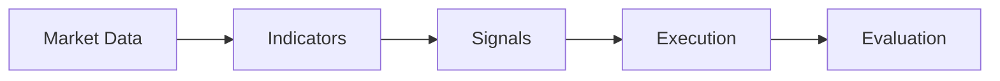
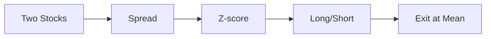
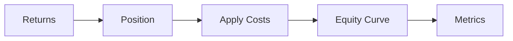
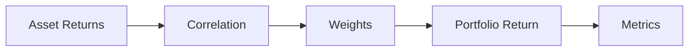
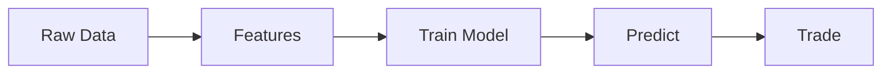

# Quantitative Modelling, Knowledge Base (Lectures 1 to 11)

This file is a study reference rebuilt from the course knowledge base for the eleven lectures of the Quantitative Modelling programme. It keeps the core concepts, formulas, and code patterns from each lecture, drops the repetitive checklists that the source document carried at the end of every chapter, and uses tables and code blocks where the original used bullet lists. Six small flowcharts are scattered through the document to make the workflow steps easier to picture.

The lectures move from foundations (how markets and OHLCV data work) through signal design and backtesting, then into pairs trading, portfolio construction, machine learning, infrastructure, and finally a robustness pass that revisits the earlier ideas with regime awareness.

## Contents

- [Lecture 1, Quantitative Research Workflow](#lecture-1-quantitative-research-workflow)
- [Lecture 2, Market Microstructure](#lecture-2-market-microstructure)
- [Lecture 3, Financial Time Series](#lecture-3-financial-time-series)
- [Lecture 4, Alpha Signals and Quant Research](#lecture-4-alpha-signals-and-quant-research)
- [Lecture 5, Alpha Signals and Quant Research 2](#lecture-5-alpha-signals-and-quant-research-2)
- [Lecture 6, Statistical Arbitrage and Pairs Trading](#lecture-6-statistical-arbitrage-and-pairs-trading)
- [Lecture 7, Backtesting Systems and Biases](#lecture-7-backtesting-systems-and-biases)
- [Lecture 8, Portfolio Construction and Risk Management](#lecture-8-portfolio-construction-and-risk-management)
- [Lecture 9, Machine Learning for Quant Trading](#lecture-9-machine-learning-for-quant-trading)
- [Lecture 10, Quant Infrastructure and KDB+/q](#lecture-10-quant-infrastructure-and-kdbq)
- [Lecture 11, Strategy Refinement and Robustness](#lecture-11-strategy-refinement-and-robustness)

## The overall workflow

The course can be summarised as five steps that you do in order. Most of the lectures explain one of these steps in more depth.



---

## Lecture 1, Quantitative Research Workflow

This lecture is the orientation chapter. It explains what quantitative trading is and what the workflow looks like before any code shows up.

### What quantitative trading actually is

Quantitative trading uses mathematics and data analysis on market information to find patterns that can be turned into trading decisions. Predictions are probabilistic, not certain; the goal is to reduce uncertainty enough to gain a small statistical edge over the market.

### Reading a market chart

A market chart shows the price of a financial instrument over time. The two main components shown together are:

- **Candlesticks**, which encode the open, high, low, and close (OHLC) for each interval. The body sits between open and close. The thin wicks reach up to the high and down to the low. Green means close was above open; red means close was below open.
- **Volume bars** at the bottom, coloured to match the candle. Tall bars mean heavy trading activity for that interval.

The instructor demonstrated these on the NIFTY 50 chart inside TradingView.

### Two basic intuitions about price behaviour

| Pattern | Intuition |
|---|---|
| Momentum | Prices tend to keep moving in the same direction for a while. |
| Mean reversion | Prices that move far from their average tend to come back to it. |

These two are the foundation of almost every strategy in the course. Indicators built on top of price data, such as moving averages or RSI, are mathematical tools to detect when one of these is happening.

### Other ideas introduced briefly

- **Volatility** is the size of price swings, often measured with standard deviation of returns. Crypto was used as the example of a highly volatile asset class.
- **Technical analysis** uses chart patterns and indicators. **Fundamental analysis** looks at economic data, company earnings, and news. The two are complementary.
- **Algorithmic trading** is computers executing trades based on rules. **Risk management** is the practice of keeping losses small enough that one bad trade does not end your career.

### What a trading desk looks like

Modern trading floors are quieter than the old open outcry pits. Traders sit at desks with several screens, and most decisions are made by algorithms that the trader supervises. The desk gets stressful around major market-moving events.

> **The goal of quantitative trading is to convert market emotions into mathematics.** Fear and greed make prices move in predictable ways often enough that you can build models around them.

---

## Lecture 2, Market Microstructure

### OHLCV is the basic unit of market data

OHLCV stands for Open, High, Low, Close, Volume. Almost every charting tool, backtesting engine, and trading strategy starts from this format.

- **Open** is the first traded price in the interval.
- **High** is the highest price in the interval.
- **Low** is the lowest price in the interval.
- **Close** is the last traded price. This one matters the most in finance because returns and most signals are computed from closes.
- **Volume** is the number of units traded during the interval.

The interval can be one minute, one hour, one day, or longer. The choice of interval determines how reactive your strategy is.

### Bid, ask, and the spread

When you place an order, two prices matter: the highest a buyer is willing to pay (the **bid**), and the lowest a seller is willing to accept (the **ask**). The ask is always at or above the bid. The difference between them is the **spread**.

```python
Spread = Ask - Bid
```

If the bid is 100 and the ask is 100.5, the spread is 0.5. A market BUY fills at the ask. A market SELL fills at the bid. So if you buy and immediately sell, you lose the spread. This is one of the implicit costs of trading.

### Liquidity

Liquidity is how easily you can trade without moving the price. A liquid market is like a wide highway, lots of orders, tight spreads, easy fills. An illiquid market is a narrow road; small orders can cause jumps and slippage.

### Two order types

| Order type | What you control | What you give up |
|---|---|---|
| Market order | Execution is guaranteed | The exact fill price is not guaranteed |
| Limit order | The price is guaranteed (or better) | Execution is not guaranteed |

A market BUY fills at the ask immediately. A limit BUY only fills if the ask is at or below your limit price; if not, the order waits.

### Slippage

Slippage is the difference between the price you expected and the price you actually got. It happens when prices move between the moment your order is sent and the moment it is filled, or when the order is too big to fill at the top of the order book and walks down to the next level.

### Code from the lecture, a simple bid and ask simulator

```python
import numpy as np
import pandas as pd
import matplotlib.pyplot as plt

np.random.seed(42)
bid_prices = 100 + np.random.normal(0, 1, 100)
ask_prices = bid_prices + 0.05
spread = ask_prices - bid_prices

df = pd.DataFrame({'Bid': bid_prices, 'Ask': ask_prices, 'Spread': spread})

plt.plot(df['Bid'], label='Bid')
plt.plot(df['Ask'], label='Ask')
plt.plot(df['Spread'], label='Spread')
plt.legend()
plt.show()
```

This is the simplest possible exchange simulator. It hard codes a constant 5 cent spread on top of a random walk bid price.

---

## Lecture 3, Financial Time Series

### Time series and asset classes

A financial time series is a sequence of price or volume observations indexed by time. Markets generate enormous quantities of this data, every trade and every order placement adds a row.

The four main asset classes covered:

| Asset class | Description |
|---|---|
| Equities | Stocks, ownership shares in a company. |
| Fixed income | Bonds, where the investor lends money and receives interest. |
| Forex | Currencies traded against each other, e.g. USD/INR. |
| Crypto | Digital assets like Bitcoin, lightly regulated and highly volatile. |

### Prices vs returns

Raw prices are not directly comparable across assets. A stock moving from 100 to 110 and a stock moving from 1000 to 1010 both moved by 10 currency units, but the first one returned 10% and the second one returned 1%. **Returns** normalise these so different assets can be compared on the same scale.

```python
# Simple percentage return
Return = (P_new - P_old) / P_old
```

In pandas this is `df['Close'].pct_change()`.

### Volatility

Volatility measures how much prices fluctuate. Higher volatility means larger swings and more uncertainty. It is often measured as the standard deviation of returns, sometimes annualised by multiplying by the square root of 252 (for daily data).

### Moving averages

A moving average smooths a noisy price series so trends become easier to see.

```python
# Simple moving average over n periods
MA_n = (P_1 + P_2 + ... + P_n) / n
```

A short moving average (say 20 days) reacts quickly to recent prices. A long moving average (say 50 days) is slower and steadier. A **crossover** between the two is a classic trading signal: when the short MA crosses above the long MA, prices are trending up.

### Trend following vs mean reversion, again

Both styles were introduced in Lecture 1 but this lecture frames them as opposing assumptions about future prices:

- **Trend following** assumes that strong moves continue for a while. Tesla, Nvidia, and Apple were cited as stocks with strong sustained trends.
- **Mean reversion** assumes that extreme moves snap back to the average. The instructor was careful that prices *may* revert, not that they *will*; new information can permanently move the fair price before reversion happens.

### Market behaviour and noise

Not every price movement carries information. Some is just noise, the trace of emotions like greed (excessive buying), fear (excessive selling), panic, or excitement. Quantitative researchers spend a lot of effort separating signal from noise.

---

## Lecture 4, Alpha Signals and Quant Research

### What alpha is

**Alpha** is a predictive edge over a benchmark. If a strategy predicts the direction of the market correctly 51% of the time, that 1% above the coin flip baseline is alpha. Quant researchers spend their working lives searching for small consistent edges of one or two percent.

The benchmark could be the broader market (an index like SPX or NIFTY), or it could be a peer firm's published returns. The instructor's example was JP Morgan returning 5.3% against Goldman Sachs' 5% benchmark: the 0.3% is the alpha.

### Most signals fail

Out of every hundred ideas a quant researcher tests, the majority do not survive. The job is mostly elimination, not discovery. A good signal that stays predictive for a few years is rare and valuable.

### Categories of alpha signals

| Category | What it looks at |
|---|---|
| Behavioural | News reactions, sentiment, herd behaviour. |
| Structural | Chart patterns, support and resistance, technical setups. |
| Liquidity driven | Volume spikes, order book imbalances, market depth changes. |

Within these categories the lecture went into five concrete signal types:

- **Momentum**, buy when price is above its moving average.
- **Mean reversion**, buy when price has fallen well below its moving average.
- **Relative strength**, compare the performance of two assets and buy the stronger one.
- **Breakout**, buy when price breaks above a recent range, often confirmed by a volume spike.
- **Volume**, treat a sudden spike in volume above the average as a signal worth acting on.

### Signal decay

> Signals weaken over time. The more traders that find the same pattern, the faster the edge disappears. A good strategy needs constant review and refresh of its parameters, or eventually it becomes useless.

### Code from the lecture

These are the canonical signal definitions the course uses everywhere afterwards.

```python
import numpy as np
import pandas as pd

np.random.seed(42)
n = 1000
dates = pd.date_range(start='2020-01-01', periods=n, freq='D')
prices = np.random.normal(100, 10, n).cumsum() + 100
volumes = np.abs(np.random.normal(50, 10, n))

df = pd.DataFrame({'close': prices, 'volume': volumes}, index=dates)

# Indicators
df['MA_10'] = df['close'].rolling(window=10).mean()
df['MA_50'] = df['close'].rolling(window=50).mean()
df['MA_20'] = df['close'].rolling(window=20).mean()
df['avg_volume'] = df['volume'].rolling(window=20).mean()

# Three signal styles, all 0 or 1
df['momentum_1'] = np.where(df['close'] > df['MA_10'], 1, 0)
df['mean_rev_1'] = np.where(df['close'] < df['MA_20'] * 0.95, 1, 0)
df['volume_1']   = np.where(df['volume'] > df['avg_volume'] * 1.5, 1, 0)
```

Notice that signals are encoded as binary 0 or 1. That is the convention the course uses throughout. A 1 means "be long for the next bar"; a 0 means "be flat".

### Market efficiency, briefly

Textbooks assume markets are perfectly efficient (all information is already in the price). In practice, markets are run by humans, who are slow and emotional, so information takes time to propagate and the prices move imperfectly. That gap is what creates trading opportunities.

---

## Lecture 5, Alpha Signals and Quant Research 2

This lecture extends Lecture 4 by adding the evaluation side of signal research. Once you have a candidate signal, how do you tell if it works?

### Feature engineering

A **feature** is any number you can compute from raw market data: returns, moving averages, volatility, volume ratios. Feature engineering is the practice of creating new features that hopefully carry predictive information.

The raw inputs are usually prices, volumes, and order book quotes. Anything mathematical you can compute from those is a candidate feature. Good features are stable over time, explainable, and not too correlated with each other.

### Hit rate and average return per trade

These are two metrics for evaluating a backtested strategy:

```python
Hit Rate = (Number of Profitable Trades / Total Number of Trades) * 100
Average Return per Trade = Sum of trade returns / Number of trades
```

A naive instinct is to optimise hit rate, but the lecture is explicit that this is a trap:

> **A high hit rate doesn't automatically mean it's a good strategy.** A strategy with 50% hit rate but where winners are five times larger than losers will beat a strategy with 80% hit rate and tiny wins. Always look at both numbers together.

The instructor noted that in real markets a 10 to 15% hit rate can still be a good strategy if the wins are large enough.

### The first hint of look-ahead bias

This lecture introduces the most important rule of backtesting, which Lecture 7 will revisit in depth: the signal at time `t` may only use information available *at or before* time `t`. To enforce this, the strategy return uses the signal from the previous bar:

```python
strategy_return = momentum.shift(1) * returns
```

Without the `.shift(1)`, the backtest is effectively using today's close to decide today's trade, which is impossible in practice and inflates the returns.

### Transaction costs and the cost ladder

Three real-world costs appear at this point in the course:

| Cost | Description |
|---|---|
| Commission | A fee charged by the exchange or broker per trade. |
| Slippage | The price moves between when you decide and when you fill. |
| Spread | Buying at the ask and selling at the bid loses you the spread. |

Costs reduce strategy returns and need to be subtracted in the backtest. In the demonstration, a constant cost of 0.001 (10 basis points) per trade pulled returns from about 11% to about 10%. That seems small but compounds across many flips.

### Cumulative return formula

```python
Cumulative Return = (1 + Strategy Return).cumprod() - 1
Net Return = Strategy Return - Cost
```

### Other concepts introduced

- **Signal stability**: a stable signal should perform consistently across different time periods and market regimes. Test on a bear period, a flat period, and a bull period; if the strategy collapses in one regime, it is not stable.
- **Information Coefficient (IC)**: a number that captures how strongly a signal's value predicts the next period's return. Most real signals have small IC values.
- **Market noise**: random fluctuations that don't represent real moves. Strategies that survive noise are sometimes called system strategies.
- **Overfitting**: the strategy memorises historical quirks instead of learning real patterns. The classic analogy: memorising exam answers instead of understanding the material.
- **Support and resistance**: price levels where the market tends to reverse. Once breached, support often becomes resistance and vice versa.
- **Market making**: providing liquidity by quoting both bid and ask, common at banks for regulatory reasons. The target is net zero risk while collecting the spread.

---

## Lecture 6, Statistical Arbitrage and Pairs Trading

### Statistical arbitrage

Statistical arbitrage is a class of strategies that exploit temporary statistical relationships between assets, rather than predicting a single asset's direction. It is different from classical arbitrage because it involves probability and risk; profits are not guaranteed.

### Pairs trading

The simplest form of statistical arbitrage. The idea is to find two assets whose prices tend to move together over the long term. When the relationship temporarily breaks down (one goes up faster than the other, or one drops while the other holds), you bet on the relationship snapping back. You go long the cheaper one and short the more expensive one.

Classic pairs:

- Visa and MasterCard
- Coca-Cola and Pepsi
- Reliance and ONGC (energy peers)
- Indian Oil and BP



### Correlation vs cointegration

| Measure | What it captures | Useful for pairs trading? |
|---|---|---|
| Correlation | How two series move together day to day, on a scale from -1 to +1. | Not enough on its own. |
| Cointegration | A statistical property where two series can wander but stay tied together by a stable long-term relationship. | Yes, this is what you want. |

The instructor used the image of two dogs on a leash. They can walk in different directions, but the leash keeps them roughly together. That bound relationship is cointegration. Correlation alone doesn't guarantee the relationship persists.

### The spread and the z-score

```python
Spread = Price_A - Price_B
Z = (current_value - rolling_mean) / rolling_std
```

The z-score tells you how unusual the current spread is, measured in standard deviations from its rolling mean. Typical entry and exit rules:

- If `Z > 2`, the spread is wide enough to bet on it narrowing, so short A and long B.
- If `Z < -2`, short B and long A.
- Exit when `Z` returns to roughly zero.

### Beta-adjusted spread

When the two assets trade at very different price levels, a simple `Price_A - Price_B` is dominated by whichever has the larger price. You can scale one side first:

```python
Beta_Adjusted_Spread = Price_A - (Beta * Price_B)
```

The beta factor brings both legs to comparable size.

### Code pattern from the lecture

```python
# Simulated mean-reverting price
noise = np.random.normal(0, 1, 1000)
random_walk = np.cumsum(noise)

# Rolling stats and z-score
rolling_mean = df['price'].rolling(window=20).mean()
rolling_std  = df['price'].rolling(window=20).std()
z_score = (df['price'] - rolling_mean) / rolling_std

# Signal from z-score
signals = pd.Series(0, index=df.index)
signals[z_score >  2] = -1   # short
signals[z_score < -2] =  1   # long
```

---

## Lecture 7, Backtesting Systems and Biases

This is the most important lecture in the course for the simplified-quant project. It explains exactly which mistakes make a backtest lie to you.

### What backtesting is

Backtesting is the process of running a strategy on historical data to see how it would have performed. It comes *after* signal generation, not before. The result tells you whether the idea looked profitable in the past. It does **not** guarantee anything about the future.

Professional researchers reject far more ideas than they deploy. The instructor mentioned that fewer than 5% of researched ideas make it to production at many firms.

### Three biases that ruin backtests

> **A strategy showing 90 to 95% returns almost always has a bias in the backtest, not a real edge.** Suspicion is the right default.

#### 1. Look-ahead bias

Look-ahead bias is using future information to make a current decision. The cleanest example: deciding to buy at the open of day `t` using the close of day `t`. The close hadn't happened yet when the open was being traded. Backtests that allow this look much better than reality.

The fix is to shift signals by one bar so that the position you take at time `t` was decided using only information available at time `t-1`:

```python
strategy_return = signal.shift(1) * returns
```

This single line is the difference between a credible backtest and a misleading one.

#### 2. Survivorship bias

If you only test your strategy on companies that still exist today, you've already removed all the failures from your data. The remaining stocks are biased upward. Mutual fund advertisements exploit this constantly: out of 100 funds launched 10 years ago, perhaps only 20 are still running. The brochure features those 20. The other 80 are invisible.

Index composition has the same problem. NIFTY 50 and S&P 500 add successful companies and remove underperformers, so an index backtest using only today's constituents already starts with a survivor bias.

#### 3. Data leakage

Data leakage is when future information enters the model's training data by accident, often through bad timestamps. The example given: downloading today's earnings data but accidentally storing it with yesterday's date, so a strategy run on yesterday's data secretly knew the earnings outcome.

### Costs and constraints, the staged demonstration

The lecture showed a moving average strategy under four progressively stricter backtests:

| Stage | Adjustment | Result in the demonstration |
|---|---|---|
| Baseline | Gross strategy returns | About 11% |
| Plus costs | Subtract 0.001 (10 bps) per trade | About 10% |
| Plus slippage | Subtract a slippage cost per trade | Lower |
| Plus liquidity filter | Trade only when volume > 20-day average | Lower still |

This staircase is the canonical way to present a backtest in the course. It shows how much of the gross alpha survives each layer of realism.



### Liquidity constraint formula

```python
if traded_volume > average_volume:
    take_trade
else:
    skip
```

A naive filter, but useful for demonstrating that not every bar is a good time to trade.

---

## Lecture 8, Portfolio Construction and Risk Management

### The two halves of professional investing

Finding a good signal is half the job. The other half is deciding how to allocate money across many signals and assets. This second half is **portfolio construction**.

### Asset classes for diversification

| Class | Risk profile | Notes |
|---|---|---|
| Stocks (equities) | Higher risk, higher return | The classic growth asset. |
| Government bonds | Low risk, low return | Considered the safest. |
| Corporate bonds | Medium risk | Pay more than government bonds but can default. |
| Real estate | Medium risk | Less volatile but can crash in severe crises. REITs give exposure without buying property. |
| Commodities | Variable | Gold, oil, etc. |

The point of mixing them is **diversification**. If your portfolio is 100% stocks, a 2020-style crash wipes out the whole thing. Holding 50% bonds softens the impact because bonds often move opposite to stocks during crises.

### Correlation and portfolio diversification

Correlation between two assets ranges from -1 (always move opposite) to +1 (always move together). Diversification works best when assets have low or negative correlation. A portfolio of ten technology stocks is barely diversified because they all move together.



### Position sizing

How much should you put into a single trade? The lecture gives a basic formula:

```python
Position Size = (Account Equity * Risk Appetite) / Stop Loss
```

With a 1000 currency account, 10% risk appetite, and 2% stop loss, you'd put 5000 nominal into the trade. The point is to size positions so a single loss doesn't blow up the account.

### The standard portfolio metrics

These six are the bread and butter of strategy evaluation. They appear in almost every later lecture too.

```python
# Daily portfolio return
portfolio_returns = returns.dot(weights)

# Annualised return (252 trading days in a year)
annual_return = portfolio_returns.mean() * 252

# Annualised volatility
volatility = portfolio_returns.std() * np.sqrt(252)

# Sharpe ratio, risk-adjusted return. R_f assumed to be 0
sharpe_ratio = annual_return / volatility

# Cumulative equity curve, starts at 1.0
cumulative_returns = (1 + portfolio_returns).cumprod()

# Maximum drawdown, biggest peak-to-trough decline
drawdown = 1 - cumulative_returns / cumulative_returns.cummax()
max_drawdown = drawdown.max()

# Win rate, fraction of periods with positive return
win_rate = (portfolio_returns > 0).sum() / len(portfolio_returns)
```

### Code pattern, downloading multi-asset data with yfinance

```python
import yfinance as yf

assets = ['AAPL', 'MSFT', 'JNJ', 'JPM', 'XOM']
data = yf.download(assets, start='2010-01-01', end='2023-01-01')['Close']
returns = data.pct_change().dropna()

correlation_matrix = returns.corr()
import seaborn as sns
sns.heatmap(correlation_matrix, annot=True, cmap='coolwarm', vmin=-1, vmax=1)
```

The heatmap is the standard way to visualise an N-by-N correlation matrix and look for diversification candidates.

### Equal vs custom weights

```python
n = len(assets)
equal_weights = [1.0 / n] * n
custom_weights = np.random.random(n)
custom_weights /= custom_weights.sum()   # normalise to 1
```

---

## Lecture 9, Machine Learning for Quant Trading

### Machine learning in finance, the cultural caveat

Machine learning is used in finance for parameter tuning, weight calibration, and clustering, but firms are cautious about deploying black box models. Explainable strategies are strongly preferred. Neural networks in particular are rarely used directly for trading because nobody can explain why they did what they did.

The instructor's main use cases:

- Calibrating weights for portfolio construction instead of using a hard-coded formula.
- Clustering stocks (K-means) into buckets of similarly behaving names.

### Feature engineering, again

A feature is a number computed from raw data. Good features:

- Are relevant to the prediction target.
- Are stable across time periods.
- Can be explained in words.
- Are available in real time (not derived from data that arrives a day late).
- Are not too correlated with the other features (or you create a multicollinearity problem).



### Overfitting

When a model has too many features or too much capacity for the data, it starts memorising noise. The classic symptom: 95% accuracy on the training set, 48% (coin flip) on the test set. Financial data is especially noisy, so overfitting is the constant enemy.

### Validation, especially walk-forward

A standard train/test split (70/30) is fine for a static dataset, but financial data has time order, so you must never let testing data leak back into training. **Walk-forward validation** is the careful version: train on years 1 to 3, test on year 4, then shift the window forward (train on years 2 to 4, test on year 5), and so on.

### Two simple models the lecture used

```python
from sklearn.linear_model import LinearRegression
from sklearn.tree import DecisionTreeRegressor, plot_tree
from sklearn.model_selection import train_test_split
from sklearn.metrics import r2_score

# Features from raw OHLCV
df['return_5']    = df['Close'].pct_change(5)
df['return_20']   = df['Close'].pct_change(20)
df['volatility']  = df['Close'].pct_change().rolling(20).std()
df['volume_ratio']= df['Volume'] / df['Volume'].rolling(20).mean()

X = df[['return_5','return_20','volatility','volume_ratio']].dropna()
y = X.shift(-1).iloc[:,0]   # tomorrow's return

X_tr, X_te, y_tr, y_te = train_test_split(X, y, test_size=0.2, random_state=42)

# Linear regression, simple and hard to overfit
linreg = LinearRegression().fit(X_tr, y_tr)
print(r2_score(y_tr, linreg.predict(X_tr)),
      r2_score(y_te, linreg.predict(X_te)))

# Decision tree, more flexible, easier to overfit. Cap depth
tree = DecisionTreeRegressor(max_depth=3, random_state=42).fit(X_tr, y_tr)
print(r2_score(y_tr, tree.predict(X_tr)),
      r2_score(y_te, tree.predict(X_te)))
```

### Other techniques mentioned

- **Feature importance**, decision trees expose this through `tree.feature_importances_`. Use it to drop the bottom features and reduce complexity.
- **PCA (Principal Component Analysis)**, a dimensionality reduction technique. If you have 50 features, PCA can compress them into 5 to 10 components that capture most of the variation.
- **K-means clustering**, group stocks by similar return behaviour to do bucket-level trading.

---

## Lecture 10, Quant Infrastructure and KDB+/q

### Why specialised infrastructure exists

Trading firms handle huge volumes of time-series data in real time. A standard SQL database is too slow. The industry-standard alternative for years has been KDB+, a columnar time-series database designed specifically for this workload.

| Component | What it does |
|---|---|
| Feed handler | Receives raw quotes and trades from the exchange. |
| Ticker plant | Distributes incoming market data to internal consumers. |
| Real-time database (RDB) | Stores the most recent data in memory. |
| Historical database (HDB) | Stores older data on disk for backtesting. |
| Query layer (Q) | The programming language used to query KDB+. |

### The Q language

Q is both a query language and a programming language. It is famously compact, lots of symbols, very short syntax, and very fast on large columnar data.

```q
/ Select all AAPL trades between 9:30 and 10:00
select from trades where sym=`AAPL, time within 09:30:00 10:00:00

/ Volume Weighted Average Price (VWAP) grouped by symbol
select vwap:avg price*size wavg size by sym from trades
       where time within 09:30 16:00
```

### VWAP formula

```python
VWAP = sum(Price * Volume) / sum(Volume)
```

VWAP is a benchmark price used by execution algorithms. Brokers often try to fill large orders at or below VWAP over the course of the day.

### Python and KDB+

The library `PyKx` lets Python connect to a KDB+ instance and pull data into pandas. This is how a research workflow combines KDB+'s storage performance with Python's analysis libraries. The lecture mentioned this but did not demonstrate it.

---

## Lecture 11, Strategy Refinement and Robustness

This final lecture is a recap with a strong message: a strategy that works in one regime may fail in another, and the only defence is rigorous validation.

### Market regimes

Markets cycle through four phases:

| Regime | Character |
|---|---|
| Bull | Rising prices, low volatility. |
| Bear | Falling prices, often slow grind down. |
| Crisis | Sharp drawdowns, high volatility. COVID 2020, GFC 2008. |
| Recovery | Sharp rebound, often choppy. |

A trend-following strategy can do beautifully in a bull regime and get crushed in a crisis. Mean reversion does the opposite in fast trends. There is no single rule that wins everywhere.

### Walk-forward validation, revisited

Walk-forward validation is more realistic than a single train/test split because it mirrors how trading actually happens. You always train on past data and test on future data, then slide the window forward and repeat.

### The look-ahead bias horror story

The instructor described a strategy showing 200% return in backtest. After removing a subtle look-ahead bias, the return was negative. This is exactly the failure mode Lecture 7 warned about.

### Performance, beyond raw returns

A strategy with 20% CAGR sounds great until you discover the max drawdown was 50%. Always look at:

- CAGR or annualised return
- Sharpe ratio
- Maximum drawdown
- Win rate
- Behaviour in stress periods (COVID, 2008, late 2018)

### Combining strategies with a weighted decay

When you have momentum and mean reversion strategies both running, you can blend them with an exponentially weighted update:

```python
W1 = W1 * lambda + (1 - lambda) * W1_new
```

With `lambda = 0.7`, the previous weight contributes 70% and the new evidence 30%. This smooths out parameter jumps when the new period of data is unusual.

### The success rate caveat

> The instructor mentioned that fewer than 5% of researched ideas survive validation and reach production. The whole point of rigorous backtesting, walk-forward validation, and regime testing is to filter out the 95% that look good in one window but break in another. A strategy that survives all of this is rare, and that rarity is exactly why quantitative trading is hard.
