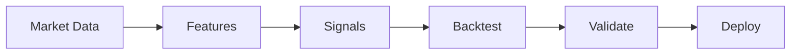

# Topic 01, Introduction to Quantitative Research

> A first map of what quant trading is, who does it, and how the work
> actually flows from raw market data to a deployed strategy.

## The big idea

Quantitative trading is the practice of making trading decisions using
data, statistics, and code instead of intuition or news. The basic move
is to take historical market data, find a statistical pattern in it,
turn that pattern into a trading rule, test the rule, and only then
risk real money on it. Every step is supposed to be reproducible by
someone else with the same data.

The reason firms run this way is not that quants are smarter than
discretionary traders. The reason is that systematic decisions are
testable and auditable. If a rule loses money, you can look at the
rule, change one parameter, and rerun the test. If a human loses money,
you have to guess what they were thinking that day. Quant trading
trades intuition for the ability to measure what you do.

The other thing to internalise early is that quant trading is
probabilistic, not deterministic. No signal works every time. A good
signal is one that wins slightly more often than it loses, over many
trades, with the wins big enough to cover the losses plus the costs of
trading. Anyone selling certainty in this field is selling fiction.

## Key concepts

### Quant trading vs traditional trading

| Traditional | Quant |
|---|---|
| Decisions based on news, intuition, charts read by eye. | Decisions based on data, statistics, code. |
| Hard to explain why a trade was taken. | The exact rule and inputs are written down. |
| Cannot be tested cleanly. | Can be backtested on historical data. |
| Mostly manual. | Mostly automated, though research is still done by humans. |

### What a quant researcher does day to day

1. Collect market data, usually OHLCV bars or tick data.
2. Study patterns in that data using statistics.
3. Turn patterns into trading signals (rules that say BUY, SELL, or HOLD).
4. Backtest the signals on history to estimate how they would have done.
5. Validate against biases that would make the backtest a lie.
6. If the signal survives validation, deploy it and monitor live.

### Alpha, in one paragraph

Alpha is a statistical edge over a benchmark. A long-only strategy that
beats the S&P 500 on a risk-adjusted basis has alpha. A pairs trading
strategy with no net market exposure has alpha if it makes money over
time. Alpha is the entire reason quant research exists, and it is the
thing that decays as more people discover the same signal.

### Two starter intuitions about price

The first is momentum: assets that have been going up tend to keep
going up for a while, because trends attract attention and buying
pressure. The second is mean reversion: prices that move too far from
their typical level tend to come back, because the move was an
overreaction. Both can be true on different timescales for the same
asset. Most of the rest of this course is variations on these two
ideas.

### Why this is hard

Markets evolve. Signals decay. Competition is intense. Transaction
costs eat into thin edges. Most strategy ideas fail validation, and
even strategies that survive validation often stop working in live
trading because the regime changes. The realistic number is that fewer
than five out of every hundred research ideas reach production.

## One diagram

The full quant research workflow at the lowest level of detail:



The rest of the course expands each box. Topic 02 is the data box.
Topic 03 is the features box. Topic 04 is the signals box. Topic 05
is the backtest and validate boxes. Topic 09 is the infrastructure
that makes all of this run at scale.

## Code patterns

The whole workflow as a one-page sketch in Python, just to anchor what
the rest of the topics will fill in:

```python
import pandas as pd
import yfinance as yf

# 1. Data
df = yf.download("SPY", start="2018-01-01", end="2024-12-31")

# 2. Features
df["Return"] = df["Close"].pct_change()
df["MA20"]   = df["Close"].rolling(20).mean()
df["MA50"]   = df["Close"].rolling(50).mean()

# 3. Signal (moving average crossover)
df["Signal"] = (df["MA20"] > df["MA50"]).astype(int)

# 4. Backtest (with the no-look-ahead shift)
df["Position"]       = df["Signal"].shift(1)
df["StrategyReturn"] = df["Position"] * df["Return"]
df["Equity"]         = (1 + df["StrategyReturn"]).cumprod()

# 5. Evaluate
total_return = df["Equity"].iloc[-1] - 1
print(f"Total return: {total_return:.2%}")
```

Each line of that snippet will be its own topic later.

## Common pitfalls

- Treating a good backtest as proof of a good strategy. Most good-looking
  backtests are wrong.
- Mistaking randomness for signal. Humans are very good at seeing
  patterns in noise.
- Optimising too many parameters until the strategy memorises the past
  instead of predicting the future.
- Forgetting that someone has to pay the spread, the commission, and
  the slippage. A 1% edge on paper can easily be 0% after costs.

> The point of quant research is to find rules that keep working, not
> rules that worked once. This is the line that separates the field
> from numerology.

## How this shows up in our project

- `src/data.py:load_ohlcv` does the data box.
- `src/indicators.py:build_indicators` does the features box.
- `src/signals.py:ma_crossover_signal` and `mean_reversion_signal` do the
  signals box.
- `src/backtest.py:run_backtest` does the backtest box.
- `src/evaluation.py:evaluate` does the validate box.
- `notebook/project_notebook.ipynb` is the end-to-end walkthrough.

## Further reading

- `lectures/Knowledge_Base.md` Lecture 1 section.
- `lectures/Lecture_3_Lab.ipynb` for the first hands-on examples.
