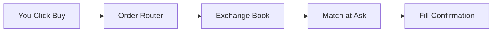

# Topic 02, OHLCV Data and Market Microstructure

> The actual structure of the data a quant works with, and what happens
> inside the exchange between the moment you press BUY and the moment
> your order fills.

## The big idea

Almost every quant project starts with OHLCV bars. A bar is a summary
of one time interval, usually one trading day, and it has five numbers:
the Open price, the High, the Low, the Close, and the Volume. From
this five-column table you can compute returns, volatility, moving
averages, and basically every classical technical indicator.

But OHLCV is already a summary. Inside that one day there were
thousands of individual trades, each happening at a specific price
between a bid and an ask. The bid is the best price a buyer is
currently offering. The ask is the best price a seller is currently
willing to take. The difference is the spread, and it is a real cost
you pay every time you cross the book.

If you are going to write code that pretends to execute trades, you
have to model this gap. The course's spread model is the simplest one
that captures the cost: Bid is Close minus half the spread, Ask is
Close plus half the spread. Market buys fill at Ask, market sells fill
at Bid. That single rule turns a clean price chart into something that
behaves like a market.

## Key concepts

### OHLCV in one table

| Field | Meaning |
|---|---|
| Open | First traded price in the interval. |
| High | Highest traded price in the interval. |
| Low | Lowest traded price in the interval. |
| Close | Last traded price in the interval. |
| Volume | Total number of shares traded in the interval. |

Volume matters because it measures activity. High volume usually means
tight spreads and reliable price discovery. Low volume means wide
spreads and the risk that your own order moves the price.

### Bid, ask, and spread

```
Bid = highest price a buyer is offering
Ask = lowest price a seller is asking
Spread = Ask - Bid
```

For SPY during regular hours the spread is one cent on a $500 stock,
which is about 0.2 basis points. For a small illiquid stock the spread
might be 50 basis points or more. The spread is the first execution
cost, and it is paid every time you cross the book.

### Market orders vs limit orders

| Order type | Fills at | Guarantees |
|---|---|---|
| Market BUY | Ask | Execution, not price. |
| Market SELL | Bid | Execution, not price. |
| Limit BUY | Ask, if Ask less than or equal to limit | Price, not execution. |
| Limit SELL | Bid, if Bid greater than or equal to limit | Price, not execution. |

A market order says "fill me now, whatever the price". A limit order
says "fill me only if the price is acceptable, otherwise wait or
never". Both have their place. Market orders get you in immediately
but pay the spread. Limit orders save the spread but might never
fill.

### Slippage and market impact

Slippage is the gap between the price you expected and the price you
got. For small orders on liquid markets it is tiny. For large orders
or illiquid markets it can dominate every other cost. If you try to
buy ten million shares of a thinly traded stock, you will eat through
many levels of the order book and end up paying much more than the
top-of-book ask suggested.

### Liquidity

Liquidity is the ability to trade size without moving the price. A
deeply liquid name like SPY can absorb millions of dollars of orders
without budging. An illiquid name will move noticeably on a few
thousand dollars. Strategies that look great on liquid names sometimes
fall apart when scaled to a less liquid universe.

## One diagram

The path of a single market BUY through the system, end to end:



## Code patterns

A minimum bid/ask attachment, the way our project does it:

```python
def add_bid_ask(df, spread=0.10):
    half = spread / 2.0
    df["Bid"]    = df["Close"] - half
    df["Ask"]    = df["Close"] + half
    df["Spread"] = spread
    return df
```

A market order that fills at the ask:

```python
def market_buy(bar):
    return {"fill_price": bar["Ask"], "side": "buy"}
```

A limit order that may not fill at all:

```python
def limit_buy(bar, limit_price):
    if bar["Ask"] <= limit_price:
        return {"fill_price": bar["Ask"], "side": "buy"}
    return None
```

## Common pitfalls

- Assuming your fills happen at the close. They do not. Buys fill at
  the ask, sells fill at the bid. The cost of always crossing the
  spread is real.
- Forgetting that a limit order can sit unfilled forever. Backtests
  that assume limit fills always happen are fantasy.
- Ignoring volume. A signal that says BUY one million shares of a
  stock that trades ten thousand shares a day cannot be executed at
  the printed prices.

> The cleanest way to get a sense of these mechanics is to build a
> tiny exchange simulator yourself. The course has one as the Lecture
> 2 assignment. It is worth doing.

## How this shows up in our project

- `src/execution.py:add_bid_ask` attaches the bid, ask, and spread to
  every bar using the lecture's half-spread model.
- `src/execution.py:execute_order` implements all four order types
  with the fill rules in the table above.
- `src/execution.py:simulate_orders` walks the bars in order and tries
  to fill each pending order, so limit orders that miss this bar can
  fill on a later one.
- The notebook's section 3.2 shows a limit buy that fills early and a
  limit sell that never fills, illustrating execution uncertainty.

## Further reading

- `lectures/Knowledge_Base.md` Lecture 2 section.
- `lectures/Lecture_2_OHLCV.ipynb` for a synthetic OHLCV constructor.
- `lectures/Mini_Exchange_Simulator_Lecture_2_Assignment.ipynb` for the
  full order-book walkthrough.
