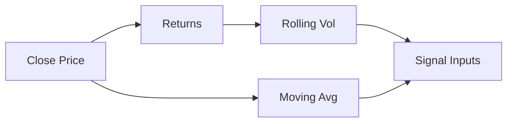

# Topic 03, Financial Time Series

> How to turn a column of prices into the actual numbers a strategy
> uses: returns, volatility, and moving averages.

## The big idea

A financial time series is data indexed by time. The most common one
is daily closing prices, but it could be intraday bars, quotes, or
even news timestamps. The first thing you learn is that you rarely
work with prices directly. You work with returns.

The reason is that prices are not comparable across assets or time
periods. A $5 move in a $50 stock is a 10% return, while the same $5
move in a $500 stock is a 1% return. Returns normalise the move into
a comparable unit. Most of the math we do later (volatility, Sharpe,
correlations) only makes sense on returns, not on raw prices.

Once you have returns, two more derived quantities matter
immediately. Volatility tells you how noisy the returns have been, and
it is the single most important measure of risk. Moving averages
smooth the price into a trend you can actually see through the noise.
These three numbers (return, volatility, moving average) are the
foundation on which every signal in the course is built.

## Key concepts

### Returns

The simple daily return:

```
Return_t = (Close_t - Close_{t-1}) / Close_{t-1}
```

In pandas this is one line:

```python
df["Return"] = df["Close"].pct_change()
```

The first row is NaN because there is no prior close to compare to.
This is normal and not a bug. Just drop or skip that row.

The cumulative return from day zero to day t:

```
CumReturn_t = (1 + R_1)(1 + R_2)...(1 + R_t) - 1
```

In pandas:

```python
df["CumReturn"] = (1 + df["Return"]).cumprod() - 1
```

Use cumulative returns to plot the growth of one rupee invested at
day zero. This is also what the equity curve in a backtest is, just
multiplied by the starting capital.

### Volatility

Volatility is the standard deviation of returns over some window.
Higher volatility means more uncertainty per day. In pandas:

```python
df["Vol20"] = df["Return"].rolling(20).std()
```

To annualise, multiply by the square root of the number of trading
days per year:

```
Annualised vol = daily_vol * sqrt(252)
```

The square root comes from the assumption that returns are
independent across days, so variance scales linearly with time and
volatility scales with the square root of time.

### Moving averages

A simple moving average is the mean of the last N closes. It smooths
out day-to-day noise and exposes the underlying trend.

```python
df["MA20"] = df["Close"].rolling(20).mean()
df["MA50"] = df["Close"].rolling(50).mean()
```

The 20-day and 50-day windows are conventional choices. 20 trading
days is roughly one calendar month, 50 is roughly two and a half.
There is nothing magic about these numbers, but they have been the
default in technical analysis for decades and are reasonable starting
points.

### Signal vs noise

Not every move means something. Markets contain a lot of random
fluctuation. The job of a quant is to find the small fraction of
movement that is repeatable (signal) and ignore the rest (noise).
Most apparent patterns in financial data are noise. Statistical
testing is how you tell the difference.

## One diagram

How a raw price series turns into the inputs a signal can use:



## Code patterns

The full indicator set the project uses, in one shot:

```python
def build_indicators(df, short_window=20, long_window=50, vol_window=20):
    df = df.copy()
    df["Return"]      = df["Close"].pct_change()
    df["CumReturn"]   = (1 + df["Return"]).cumprod() - 1
    df["MA20"]        = df["Close"].rolling(short_window).mean()
    df["MA50"]        = df["Close"].rolling(long_window).mean()
    df["Vol20"]       = df["Return"].rolling(vol_window).std()
    df["AvgVolume20"] = df["Volume"].rolling(vol_window).mean()
    return df
```

A quick plot of price with both moving averages:

```python
import matplotlib.pyplot as plt
fig, ax = plt.subplots(figsize=(11, 4))
ax.plot(df.index, df["Close"], label="Close")
ax.plot(df.index, df["MA20"],  label="MA20")
ax.plot(df.index, df["MA50"],  label="MA50")
ax.legend(); ax.grid(alpha=0.3); plt.show()
```

## Worked example

A small 6-day price series. We will turn closes into returns, a 3-day
moving average, the cumulative return, and a 3-day rolling volatility.

Start with the closes:

| Day | Close |
|---:|---:|
| 1 | 100.00 |
| 2 | 102.00 |
| 3 | 101.00 |
| 4 | 105.00 |
| 5 | 103.00 |
| 6 | 108.00 |

**Simple return** is `Close_t / Close_{t-1} - 1`. Day 1 has no prior, so
it is undefined. Day 2: `102/100 - 1 = 0.0200`. Day 3: `101/102 - 1 = -0.0098`.
Day 4: `105/101 - 1 = 0.0396`. Day 5: `103/105 - 1 = -0.0190`. Day 6:
`108/103 - 1 = 0.0485`.

**3-day SMA** is the average of the last three closes. The first valid
value is at day 3. Day 3: `(100+102+101)/3 = 101.00`. Day 4:
`(102+101+105)/3 = 102.67`. Day 5: `(101+105+103)/3 = 103.00`. Day 6:
`(105+103+108)/3 = 105.33`.

**Cumulative return** is `(1 + Return).cumprod() - 1`. We start at 0 on
day 1 (no return yet). Day 2: `1.0200 - 1 = 0.0200`. Day 3:
`1.0200 * 0.9902 - 1 = 0.0100`. Day 4:
`1.0100 * 1.0396 - 1 = 0.0500`. Day 5:
`1.0500 * 0.9810 - 1 = 0.0300`. Day 6:
`1.0300 * 1.0485 - 1 = 0.0800`.

**3-day rolling std** of returns. First valid value at day 4 (needs
3 return observations). Day 4 uses returns from days 2, 3, 4 which are
`0.0200, -0.0098, 0.0396`. The sample std is about `0.0250`. Day 5
uses `-0.0098, 0.0396, -0.0190`, std about `0.0314`. Day 6 uses
`0.0396, -0.0190, 0.0485`, std about `0.0367`.

Everything in one table:

| Day | Close | Return | SMA3 | CumReturn | Vol3 |
|---:|---:|---:|---:|---:|---:|
| 1 | 100.00 | n/a     | n/a    | 0.0000 | n/a |
| 2 | 102.00 | 0.0200  | n/a    | 0.0200 | n/a |
| 3 | 101.00 | -0.0098 | 101.00 | 0.0100 | n/a |
| 4 | 105.00 | 0.0396  | 102.67 | 0.0500 | 0.0250 |
| 5 | 103.00 | -0.0190 | 103.00 | 0.0300 | 0.0314 |
| 6 | 108.00 | 0.0485  | 105.33 | 0.0800 | 0.0367 |

```python
import pandas as pd
close = pd.Series([100, 102, 101, 105, 103, 108], name="Close")
df = pd.DataFrame({"Close": close})
df["Return"]    = df["Close"].pct_change()
df["SMA3"]      = df["Close"].rolling(3).mean()
df["CumReturn"] = (1 + df["Return"].fillna(0)).cumprod() - 1
df["Vol3"]      = df["Return"].rolling(3).std()
print(df.round(4))
```

The takeaway: returns let you compare days of different prices, the SMA
smooths the recent price into a trend line, the cumulative return shows
where you are versus the start, and the rolling std tells you how noisy
the recent returns have been. Four indicators, four lines of pandas.

## Common pitfalls

- Plotting prices on different assets on the same chart without
  normalising. Use returns or rebase to 1.0.
- Using a rolling window so long it eats most of the data. A 200-day
  window on a 250-day dataset leaves you 50 usable rows.
- Confusing simple returns with log returns. They are close for small
  moves but differ noticeably for large ones. The course uses simple
  returns.
- Forgetting that the first N-1 rows of any rolling window are NaN
  and need to be handled before they enter a signal.

> The first plot you should make on any new dataset is the close
> price with both moving averages on top. Half the regimes in a
> chart become visible as soon as you can see whether MA20 is above
> or below MA50.

## How this shows up in our project

- `src/indicators.py:add_returns` computes simple and cumulative
  returns.
- `src/indicators.py:add_moving_average` adds a single MA column with
  the given window.
- `src/indicators.py:add_rolling_volatility` computes the 20-day
  rolling standard deviation of returns, with an optional
  annualisation flag.
- `src/indicators.py:build_indicators` is the one-call helper that
  attaches the full set of indicators used in the notebook.

## Further reading

- `lectures/Knowledge_Base.md` Lecture 3 section.
- `lectures/Lecture_3_Lab.ipynb` for the lab walkthrough.
