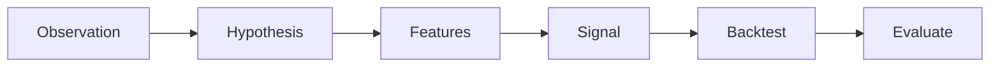

# Topic 04, Alpha Signals and Quant Research

> What an alpha signal actually is, the main families of signals used
> in practice, and how to evaluate whether a signal is real or just
> luck.

## The big idea

Alpha is the predictive edge a strategy has over a benchmark. If you
hold the index and earn 10%, that is not alpha. If you trade an
active strategy and earn 12% with the same risk, that extra 2% is
alpha. The whole point of quant research is to find rules that
produce alpha after costs.

Alpha exists because markets are not perfectly efficient. Humans,
institutions, and liquidity constraints create patterns. Information
spreads gradually. Forced flows from rebalancing happen at predictable
times. Each of these creates a small statistical edge that a careful
researcher can find and trade. But every edge is small, every edge
decays as more people find it, and every edge has periods where it
loses money. There is no signal that wins all the time.

The hardest part of alpha research is not finding patterns. Humans
find patterns in pure noise. The hard part is telling whether the
pattern you found is real (a signal) or a statistical accident
(noise). Most of the energy in this course goes into that question.

## Key concepts

### Five common signal families

| Family | Idea | Typical input |
|---|---|---|
| Momentum | Trends continue. | Past returns, MA crossovers, breakouts. |
| Mean reversion | Extremes revert. | Z-score of price vs rolling mean. |
| Breakout | Levels matter. | Highs and lows over a window. |
| Volume | Volume confirms moves. | Volume spike vs average. |
| Cross-sectional | Rank assets against each other. | Today's strongest vs weakest names. |

Each family has many specific implementations. Momentum alone covers
short-term reversal, long-term momentum, MA crossovers, breakout
continuation, and many others. The lecture spends the most time on
momentum and mean reversion because they are the easiest to test
and the most common in practice.

### Momentum, the simplest example

A textbook momentum signal:

```python
df["Signal"] = (df["MA20"] > df["MA50"]).astype(int)
```

This says: be long when the short moving average is above the long
one, otherwise flat. It is the rule we use in the project as
Strategy A. The intuition is that when the recent average price is
higher than the longer-term average, the market is trending up, and
we want to participate.

### Mean reversion, the simplest example

A textbook mean reversion signal:

```python
df["Signal"] = (df["Close"] < 0.97 * df["MA20"]).astype(int)
```

This says: be long when the close has fallen more than 3% below its
20-day mean, otherwise flat. The intuition is that a 3% drop in one
or two days on a large index is usually an overreaction that gets
unwound in the following days.

### Evaluating a signal

Three metrics matter early in evaluation:

1. **Hit rate.** Fraction of trades that are profitable. Easy to
   compute, easy to misinterpret. A 70% hit rate with a 0.1% average
   winner and a 2% average loser is a losing strategy.
2. **Average return per trade.** The expectation of one round trip,
   after fees. If this is positive and stable, the strategy has
   positive expectancy. This matters more than hit rate.
3. **Information coefficient (IC).** Correlation between the signal
   value at time t and the realised return from t to t+k. High IC
   means the signal genuinely predicts. The course covers this only
   briefly but it is the standard professional measure.

### Why signals fail

Signals fail for four common reasons:

- **Overfitting.** Too many parameters, optimised on too little data.
- **Regime change.** The market behaves differently now than it did
  in the training period.
- **Transaction costs.** A 1% edge on paper is 0% after costs.
- **Crowding.** Once enough people trade the signal, the edge gets
  arbitraged away.

## One diagram

The research pipeline from idea to signal:



## Code patterns

### Momentum (MA crossover) with the no-look-ahead shift

```python
def ma_crossover_signal(df, short=20, long=50):
    df = df.copy()
    df["MA_S"] = df["Close"].rolling(short).mean()
    df["MA_L"] = df["Close"].rolling(long).mean()
    df["Signal"]   = (df["MA_S"] > df["MA_L"]).astype(int)
    df["Position"] = df["Signal"].shift(1).fillna(0)
    return df
```

### Mean reversion

```python
def mean_reversion_signal(df, window=20, band=0.03):
    df = df.copy()
    df["MA"] = df["Close"].rolling(window).mean()
    df["Signal"]   = (df["Close"] < (1 - band) * df["MA"]).astype(int)
    df["Position"] = df["Signal"].shift(1).fillna(0)
    return df
```

### Computing the hit rate from a backtest

```python
trades = df.loc[df["Trade"] == 1, "TradeReturn"]
hit_rate = (trades > 0).mean()
avg_trade = trades.mean()
```

## Worked example

A simple momentum signal on an 8-day price series. The rule is:

> Signal at day t is 1 if `Close_t > MA3_t`, else 0. Position for day t+1
> is `Signal_t` (the shift by one bar).

Start with closes and compute the 3-day MA. MA3 is valid from day 3.

| Day | Close | MA3 | Signal | Position (next day) |
|---:|---:|---:|:---:|:---:|
| 1 | 100.00 | n/a    | 0 | 0 |
| 2 | 102.00 | n/a    | 0 | 0 |
| 3 | 101.00 | 101.00 | 0 | 0 |
| 4 | 105.00 | 102.67 | 1 | 0 |
| 5 | 103.00 | 103.00 | 0 | 1 |
| 6 | 108.00 | 105.33 | 1 | 0 |
| 7 | 107.00 | 106.00 | 1 | 1 |
| 8 | 110.00 | 108.33 | 1 | 1 |

Note carefully: the Position column is the Signal shifted down by one row.
Day 5's position (1) was decided by day 4's signal. This is the
`signal.shift(1)` rule that keeps us from cheating.

Now compute the strategy return per day. The return on day t is
`Close_t / Close_{t-1} - 1`. The strategy return on day t is
`Position_t * Return_t`.

| Day | Return | Position | Strategy Return |
|---:|---:|:---:|---:|
| 2 | 0.0200  | 0 | 0.0000 |
| 3 | -0.0098 | 0 | 0.0000 |
| 4 | 0.0396  | 0 | 0.0000 |
| 5 | -0.0190 | 1 | -0.0190 |
| 6 | 0.0485  | 0 | 0.0000 |
| 7 | -0.0093 | 1 | -0.0093 |
| 8 | 0.0280  | 1 | 0.0280 |

Three bars in the market: days 5, 7, 8. Per-bar hit rate:
`(0 wins) / 3 in-market bars`. Wait, day 8 is positive. Recount:
day 5 negative, day 7 negative, day 8 positive. Hit rate is `1/3 = 33%`.

Total strategy return: `-0.0190 + -0.0093 + 0.0280 = -0.0003`. Almost
flat. Buy and hold over the same 8 days: `(110 - 100) / 100 = 10%`.
The strategy caught only a fraction of the move because it was out of
the market on the big up days 4 and 6.

```python
import pandas as pd
close = pd.Series([100, 102, 101, 105, 103, 108, 107, 110])
ma3 = close.rolling(3).mean()
signal = (close > ma3).astype(int)
position = signal.shift(1).fillna(0)
ret = close.pct_change().fillna(0)
strat_ret = position * ret
print("Total:", strat_ret.sum(), "BuyHold:", close.iloc[-1]/close.iloc[0]-1)
```

The takeaway: a simple momentum rule does not automatically beat buy
and hold. On this tiny sample it underperformed by 10 percentage points
in eight days. Eight days is too few to conclude anything, but the
pattern (out of the market on the best days) is exactly why many
filter-based strategies disappoint in real backtests.

## Common pitfalls

- Optimising parameters until the backtest is beautiful. This is the
  fastest way to overfit. The lecture warns that strategies which look
  too perfect almost always are.
- Trusting hit rate alone. The combination that matters is hit rate
  AND average winner size vs average loser size.
- Forgetting that signals decay. A signal that worked from 2010 to
  2015 might be dead by 2020 because everyone else found it too.
- Comparing strategies without using the same costs and the same
  benchmark.

> A high hit rate with a tiny average winner is not a strategy. It is
> a portfolio of small wins waiting for one large loss to wipe them
> out. Always look at the per-trade distribution, not just the
> headline number.

## How this shows up in our project

- `src/signals.py:ma_crossover_signal` implements Strategy A from
  this topic with the exact MA20 over MA50 rule.
- `src/signals.py:mean_reversion_signal` implements Strategy B with
  a 3% band below MA20.
- `src/signals.py:buy_and_hold_signal` is the benchmark that every
  active strategy has to beat.
- The 0/1 signal encoding and the `Position = Signal.shift(1)`
  convention apply to all three. This is the no-look-ahead rule from
  Topic 05.
- `src/evaluation.py:evaluate` reports hit rate and average trade
  return on top of the standard performance metrics.

## Further reading

- `lectures/Knowledge_Base.md` Lecture 4 section.
- `lectures/Lecture_4_Signal_Discovery.ipynb` for the full lab with
  multiple signal families.
