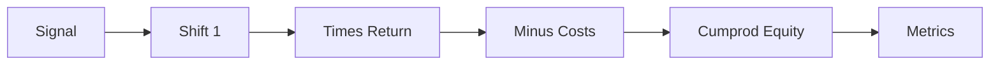

# Topic 05, Backtesting Systems and Biases

> How to apply a strategy to historical data, what biases can ruin
> the result, and what costs you have to subtract to get from a
> backtest profit to a realistic estimate.

## The big idea

A backtest is just running your strategy rules on past data to see
what would have happened if you had traded them. The mechanics are
boring: take the signal, shift it by one bar, multiply by the
return, accumulate. The hard part is not the math. The hard part is
making the backtest realistic enough that the result actually
predicts what would happen in live trading.

A backtest can be wrong in many quiet, plausible-looking ways. The
strategy can secretly use future information (look-ahead bias). The
dataset can have only the surviving winners and quietly drop the
failures (survivorship bias). The strategy can be optimised so hard
that it just memorises the past (overfitting). The model can use
features that contain information not available at trade time (data
leakage). Each of these turns a backtest into a comforting fiction.

This is why professional research treats backtest design as the most
important step. Most of the work is not finding alpha. Most of the
work is proving the alpha you think you found is actually real.

## Key concepts

### The four biases

| Bias | What goes wrong | How to prevent |
|---|---|---|
| Look-ahead | Strategy uses information it would not have had. | Always `signal.shift(1)`. Validate timestamps. |
| Survivorship | Dataset only contains assets that survived. | Use point-in-time index constituents. |
| Overfitting | Too many parameters fit to noise. | Hold out test data. Keep models simple. |
| Data leakage | Future information sneaks into features. | Strict train/test separation. Audit features. |

### Look-ahead bias in code

The single most important rule in backtesting:

```python
# WRONG. The signal at time t uses information from Close_t,
# but pretends the trade happened at Close_t. Future leak.
df["StrategyReturn"] = df["Signal"] * df["Return"]

# RIGHT. The signal at time t-1 determines the position for
# the move from t-1 to t. No future information.
df["Position"]       = df["Signal"].shift(1)
df["StrategyReturn"] = df["Position"] * df["Return"]
```

Without the shift, the strategy is allowed to "buy on Monday because
I know Tuesday closed higher". This is cheating, and it can easily
double the apparent Sharpe of a strategy.

### Equity curve and drawdown

The equity curve is one rupee compounded over time:

```python
df["Equity"] = (1 + df["StrategyReturn"]).cumprod()
```

A drawdown is the percentage gap between the running peak equity and
the current equity:

```python
df["Drawdown"] = df["Equity"] / df["Equity"].cummax() - 1
```

Max drawdown is the worst value of the drawdown series. It is the
single most important risk number in a backtest because it tells you
the worst losing streak a real trader would have lived through.

### Transaction costs and the cost ladder

The course teaches the cost ladder, four progressively stricter
regimes:

| Stage | What's deducted | Realistic? |
|---|---|---|
| Gross | Nothing. | No, this is the cheating version. |
| + Costs | Fixed commission (e.g. 10 bps) per flip. | Closer. |
| + Slippage | Add 5 bps slippage per flip. | Realistic. |
| + Liquidity filter | Skip days with below-average volume. | Stress-tested. |

The lecture's recommended numbers are 10 bps cost and 5 bps slippage
per flip. A flip is any transition from flat to long or long to flat.
For a strategy that makes 15 flips in 7 years (like our MA crossover
on SPY) that is 15 times 15 bps, or 225 bps total. Small but not
zero.

### Validation workflow

Train-validate-test is the standard split:

1. **Train.** Fit the strategy parameters on data the model is
   allowed to look at freely.
2. **Validate.** Evaluate on data the model has not seen during
   parameter selection. Use this to choose final hyperparameters.
3. **Test.** Evaluate one last time on data the model has never
   seen. This number is the honest estimate. Do not tune anything
   after seeing it.

Walk-forward validation generalises this. Roll the train and test
windows forward through time, retrain each step, and report the
average out-of-sample performance. Walk-forward catches strategies
that work in one regime but fail in another.

## One diagram

The vectorised backtest pipeline, step by step:



## Code patterns

### A full vectorised backtest in seven lines

```python
df["Return"]         = df["Close"].pct_change()
df["Position"]       = df["Signal"].shift(1).fillna(0)
df["Trade"]          = (df["Position"].diff().fillna(0) != 0).astype(int)
df["GrossReturn"]    = df["Position"] * df["Return"]
df["StrategyReturn"] = df["GrossReturn"] - df["Trade"] * 0.0015
df["Equity"]         = (1 + df["StrategyReturn"]).cumprod()
df["Drawdown"]       = df["Equity"] / df["Equity"].cummax() - 1
```

The 0.0015 is 10 bps cost plus 5 bps slippage, applied on every
flip.

### Sharpe ratio, in the form the project uses

```python
import numpy as np
ann_ret    = df["StrategyReturn"].mean() * 252
ann_vol    = df["StrategyReturn"].std()  * np.sqrt(252)
sharpe     = ann_ret / ann_vol if ann_vol > 0 else float("nan")
```

The 252 is the number of trading days in a year. Sharpe assumes
risk-free rate of zero, which is fine for a course project.

## Common pitfalls

- Forgetting the `.shift(1)`. This is the most expensive mistake in
  the entire field.
- Charging transaction cost on every bar instead of every flip. The
  cost only applies when you actually change position.
- Reporting the gross equity curve as if it were realistic. Always
  show at least one cost regime.
- Treating max drawdown as just a number. A 30% max drawdown means a
  real trader would have lost 30% of their capital at some point.
  Most retail traders quit at 20%.

> Good backtest does not equal good strategy. Two strategies with
> the same Sharpe can have very different out-of-sample behaviour.
> Walk-forward validation is the only honest way to estimate live
> performance from history.

## How this shows up in our project

- `src/backtest.py:run_backtest` is the full pipeline shown above,
  with the cost regime taken from a `BacktestConfig` dataclass.
- The `Position = Signal.shift(1)` rule is enforced in every signal
  generator in `src/signals.py`, not just the backtest.
- `src/evaluation.py:evaluate` computes Sharpe, max drawdown, total
  return, hit rate, and the per-trade distribution.
- The cost ladder appears in notebook section 4.4 and in the report
  results table.
- `verify.py` at the project root has invariant tests that assert
  `Position[t] == Signal[t-1]` for every strategy on every bar.

## Further reading

- `lectures/Knowledge_Base.md` Lecture 5 and Lecture 7 sections.
- `lectures/Lecture_5_Backtesting_Part_1.ipynb` for the look-ahead
  bias demonstration.
- `lectures/Lecture_5_Backtesting_Part_2.ipynb` for the cost ladder.
