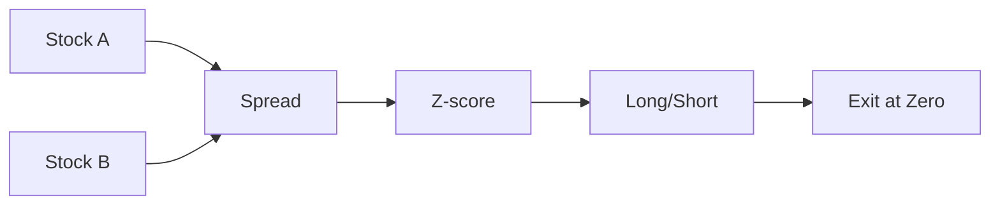

# Topic 06, Statistical Arbitrage and Pairs Trading

> Trading the relationship between two related assets instead of
> betting on either one going up or down.

## The big idea

Classical arbitrage is buying something cheap on one exchange and
selling it for more on another. In theory it is risk-free, but in
practice these gaps close in milliseconds and only firms with the
fastest networks can capture them. The retail equivalent does not
really exist anymore.

Statistical arbitrage is the probabilistic cousin. Instead of finding
an exact mispricing, you find two assets that historically move
together, and you bet that any temporary divergence between them will
close. The classic examples are Coke and Pepsi, Visa and Mastercard,
or two ETFs that track similar indices. When one moves up faster than
the other, you sell the leader and buy the laggard, expecting the
gap to narrow.

This is called market-neutral trading because the position has no
net long or short exposure to the broad market. If the whole market
falls, you lose on the long leg but make it back on the short leg.
What you are betting on is the relationship, not the direction.

## Key concepts

### Mean reversion vs trend following

These are the two opposite philosophies in trading. Mean reversion
assumes prices have an anchor they come back to. Trend following
assumes prices that are moving will keep moving. Both can be true
at different timescales. Mean reversion typically works on shorter
horizons (hours to weeks) while trend following typically works on
longer ones (weeks to months).

### Stationary vs non-stationary series

A time series is stationary if its mean and variance do not change
over time. Stock prices are non-stationary. They drift upward over
decades. Returns are roughly stationary. The spread between two
cointegrated stocks is stationary by construction, which is why
pairs trading works on the spread rather than on either stock
directly.

### Z-score

The z-score expresses a value as distance from its rolling mean in
units of rolling standard deviation:

```
z_t = (x_t - rolling_mean(x)) / rolling_std(x)
```

Interpretation:

| z | Meaning |
|---|---|
| 0 | At the mean. |
| +/- 1 | One standard deviation away. Common. |
| +/- 2 | Two standard deviations. Less common. |
| +/- 3 | Three standard deviations. Rare. |

Trading logic:

| Condition | Action |
|---|---|
| z > 2 | The spread is too high. Short it. |
| z < -2 | The spread is too low. Long it. |
| z near 0 | Exit. |

### Correlation vs cointegration

This is the single most important distinction in this topic.

| Property | Tells you |
|---|---|
| Correlation | Two series move in the same direction day to day. |
| Cointegration | Their long-term relationship is stable, even if individually they drift. |

High correlation does not imply cointegration. Two stocks can both
have a 0.9 correlation in daily returns and still drift apart
forever in price. Cointegration tests (Engle-Granger, Johansen)
check whether the spread between them is stationary. Without
cointegration, the spread will drift away and never come back, and
your mean reversion bet just loses indefinitely.

### Spread and beta-adjusted spread

The simplest spread is just the price difference:

```
Spread = A - B
```

This works only if A and B move with roughly equal magnitude. For
unequal-magnitude pairs, fit a regression slope (beta) first:

```
Spread = A - beta * B
```

This is the residual after regressing A on B. The residual should
oscillate around zero if the pair is cointegrated.

## One diagram

The pairs trading flow from raw prices to trade:



## Code patterns

### Building the spread and z-score

```python
import statsmodels.api as sm

# Fit beta by regressing A on B
X = sm.add_constant(df["B"])
beta = sm.OLS(df["A"], X).fit().params[1]

# Spread and rolling z-score
df["Spread"] = df["A"] - beta * df["B"]
df["MA"]     = df["Spread"].rolling(20).mean()
df["SD"]     = df["Spread"].rolling(20).std()
df["Z"]      = (df["Spread"] - df["MA"]) / df["SD"]
```

### Generating the trade signal

```python
import numpy as np
df["Signal"] = np.where(df["Z"] >  2, -1,
              np.where(df["Z"] < -2,  1, 0))
# +1 = long A short B, -1 = short A long B, 0 = flat
df["Position"] = df["Signal"].shift(1).fillna(0)
```

### Testing for cointegration (Engle-Granger)

```python
from statsmodels.tsa.stattools import coint
t_stat, p_value, _ = coint(df["A"], df["B"])
is_cointegrated = p_value < 0.05
```

A p-value below 0.05 is the standard threshold. Even then, run the
test on rolling windows. A pair that was cointegrated five years ago
may not be cointegrated today.

## Worked example

Coca-Cola (KO) and Pepsi (PEP) usually drift together. We will walk
through one round trip on a 6-day toy series.

| Day | KO | PEP | Spread = KO - PEP |
|---:|---:|---:|---:|
| 1 | 60.00 | 175.00 | -115.00 |
| 2 | 60.50 | 174.00 | -113.50 |
| 3 | 61.00 | 173.00 | -112.00 |
| 4 | 62.00 | 172.00 | -110.00 |
| 5 | 61.50 | 173.50 | -112.00 |
| 6 | 60.50 | 175.00 | -114.50 |

**Compute the spread's mean and std** over the full window (in real
research this would be a rolling window over many more days):

```
mean(spread) = (-115 + -113.5 + -112 + -110 + -112 + -114.5) / 6 = -112.83
std(spread)  approx 1.79
```

**Z-score** is `(spread - mean) / std` for each day:

| Day | Spread | Z |
|---:|---:|---:|
| 1 | -115.00 | -1.21 |
| 2 | -113.50 | -0.37 |
| 3 | -112.00 | +0.46 |
| 4 | -110.00 | +1.58 |
| 5 | -112.00 | +0.46 |
| 6 | -114.50 | -0.93 |

**Entry rule**: open the trade when `|Z| > 1.5`. **Exit rule**: close
when Z reverts to 0.

On day 4, Z = +1.58 (just above 1.5). The spread is unusually wide on
the upside, meaning KO is too expensive relative to PEP (or PEP is too
cheap). Trade direction:

- **Short KO** at 62.00, 1 share. Proceeds: $62.00.
- **Long PEP** at 172.00, 1 share. Cost: $172.00.

Hold the trade. On day 5 the z-score drops back toward zero (+0.46),
crossing zero somewhere between day 5 and day 6. Close the trade on
day 6 when Z = -0.93 (already past zero from above):

- **Cover the short on KO** at 60.50, 1 share. Cost: $60.50.
- **Sell the long on PEP** at 175.00, 1 share. Proceeds: $175.00.

PnL:

```
KO leg:  +62.00 - 60.50 = +1.50 (shorted high, covered low, profit)
PEP leg: -172.00 + 175.00 = +3.00 (bought low, sold high, profit)
Total PnL = +1.50 + 3.00 = +4.50
```

Both legs were profitable here because the spread itself reverted. That
is the whole point of pairs trading: you do not care about the absolute
direction of KO or PEP, you care about the spread between them
converging back to its mean.

```python
import pandas as pd
ko  = pd.Series([60.0, 60.5, 61.0, 62.0, 61.5, 60.5])
pep = pd.Series([175.0, 174.0, 173.0, 172.0, 173.5, 175.0])
spread = ko - pep
z = (spread - spread.mean()) / spread.std()
print(pd.DataFrame({"KO": ko, "PEP": pep, "Spread": spread, "Z": z.round(2)}))
```

The takeaway: in a pair trade the profit comes from the spread
reverting, not from picking a direction. If the spread keeps widening
instead of reverting, both legs lose at once. That is the failure mode
to watch.

## Common pitfalls

- Treating correlation as cointegration. The lecture spends a full
  slide on this and the demo notebook has explicit "dogs on a leash"
  examples.
- Trading a pair without checking cointegration on a rolling
  window. Structural change (a merger, a new competitor) can break
  the relationship permanently.
- Forgetting that pairs trading needs short selling. If your account
  cannot short, you cannot implement the strategy as written.
- Sizing both legs equally in dollars without beta adjustment. The
  spread will be dominated by whichever leg has larger absolute
  moves.

> When a cointegrated pair breaks, it breaks permanently. The classic
> failure mode is a strategy that worked for years on a pair, then
> one company changes management or industry, the relationship
> dissolves, and the strategy keeps doubling down on a spread that
> never reverts.

## How this shows up in our project

- Our project implements a single-asset mean reversion strategy
  (`src/signals.py:mean_reversion_signal`) but does not include
  pairs trading. The single-asset version uses the same z-score
  intuition applied to one stock against its own moving average
  instead of against a partner asset.
- The execution layer in `src/execution.py` would need a second
  side of the trade to handle pairs cleanly. Extending it is
  straightforward but out of scope for the final project.

## Further reading

- `lectures/Knowledge_Base.md` Lecture 6 section.
- `lectures/Lecture_6_Statistical_Arbitrage_&_Paris_Trading_part_1.ipynb`
- `lectures/Lecture_6_Statistical_Arbitrage_&_Paris_Trading_part_2.ipynb`
