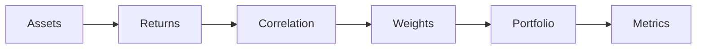

# Topic 07, Portfolio Construction and Risk Management

> Once you have one strategy that works, you still need to decide how
> much capital to allocate to it, how to combine it with other
> strategies, and how to keep the whole thing from blowing up.

## The big idea

A single trading strategy on a single asset is fragile. Any one rule
will have periods of underperformance, sometimes for years. A
portfolio is the answer. By spreading capital across multiple
assets and multiple strategies, you reduce the chance that any one
bad outcome wipes you out. This is diversification, and it is the
oldest and best-supported idea in finance.

The trick is that diversification only works when the things you
diversify into behave differently. Two stocks that always move
together give you no risk reduction. The fewer they move together,
the more variance you cancel out by combining them. Correlation is
the math behind this intuition. Cov-variance matrices and
optimisers are how professionals turn it into a portfolio.

Beyond diversification, risk management is about limits. How much
of the book is in any one position. How much in any one sector. How
much drawdown the strategy is allowed before it gets shut down.
These limits are unfashionable until they save your firm during a
crisis. The course's lesson is that risk management is not a
constraint on profit, it is the prerequisite for survival.

## Key concepts

### Why diversification works

Combining two assets reduces portfolio variance whenever their
correlation is less than one. The math:

```
Var(w_a R_a + w_b R_b) = w_a^2 Var_a + w_b^2 Var_b + 2 w_a w_b Cov(R_a, R_b)
```

If correlation is high, the covariance term is large and the
variance reduction is small. If correlation is low or negative, the
covariance term shrinks or flips sign, and the portfolio variance
drops below the average of the two individual variances. This is
why fund managers care about correlation, not just expected return.

### The four portfolio metrics

| Metric | Formula | Interpretation |
|---|---|---|
| Annualised return | `mean(R_d) * 252` | Average daily return scaled to one year. |
| Annualised volatility | `std(R_d) * sqrt(252)` | Standard deviation of daily returns scaled to one year. |
| Sharpe ratio | `ann_return / ann_vol` | Return per unit of risk. |
| Max drawdown | `max(1 - Equity / Equity.cummax())` | Worst peak-to-trough loss. |

Sharpe ratio is the headline number. Interpretation guide:

- 0.0 to 0.5: Mediocre.
- 0.5 to 1.0: Decent retail strategy.
- 1.0 to 2.0: Good institutional strategy.
- Above 2.0: Either exceptional, or you have a bug.

### Position sizing

A signal tells you what to do. Position sizing tells you how much. A
common approach is to scale position size with the strategy's
recent volatility (target a fixed risk per trade) or with the
strength of the signal (size up when the z-score is more extreme).
Position sizing is often more important than signal accuracy: a 60%
hit rate strategy with bad sizing can lose money, while a 50% hit
rate strategy with good sizing can compound.

A simple formula:

```
Position size (dollars) = Risk per trade (dollars) / Stop loss (dollars)
```

If you are willing to risk 1,000 per trade and your stop is 5 per
share, your position is 200 shares.

### Equal vs custom weights

The simplest portfolio is equal-weight: divide capital equally
across N assets. It is surprisingly hard to beat, because optimised
portfolios depend on inputs (expected returns, covariance matrix)
that are noisy and hard to estimate. Most papers comparing equal
weight to mean-variance optimised portfolios find equal weight wins
out of sample. Start there.

Custom weights make sense when you have strong prior information
about which assets should dominate the portfolio. For example, you
might overweight assets with lower volatility or higher Sharpe in
their own backtest.

### Stop losses and drawdown limits

Stop losses cut a losing trade before it becomes catastrophic. They
are blunt but effective. The catch is that stops often trigger right
at the bottom of a temporary dip, costing you the rebound. Use them
sparingly and only on strategies where the loss distribution has
fat left tails.

Portfolio-level drawdown limits are stricter: when the whole book
loses more than X% from peak, scale down or shut down. Most
professional funds have soft limits at 10% and hard limits at 20%.

## One diagram

How a portfolio comes together from individual assets:



## Code patterns

### Downloading multiple tickers at once

```python
import yfinance as yf
prices = yf.download(["AAPL", "MSFT", "GOOGL"],
                     start="2020-01-01", end="2024-12-31")["Close"]
returns = prices.pct_change().dropna()
```

### Equal-weight portfolio

```python
weights = [1 / len(returns.columns)] * len(returns.columns)
port_return = returns.dot(weights)
```

### Correlation and covariance matrix

```python
corr = returns.corr()
cov  = returns.cov()
```

### Computing Sharpe, drawdown, and the full performance set

```python
import numpy as np
ann_ret = port_return.mean() * 252
ann_vol = port_return.std()  * np.sqrt(252)
sharpe  = ann_ret / ann_vol

equity   = (1 + port_return).cumprod()
drawdown = equity / equity.cummax() - 1
max_dd   = drawdown.min()
```

## Worked example

Two assets with the following properties:

| Asset | Annual return | Annual vol |
|---|---:|---:|
| A | 10% | 15% |
| B | 6%  | 8%  |

Correlation between A and B: 0.3.

The portfolio return is just the weighted sum of asset returns:

```
ret_p = w_A * ret_A + w_B * ret_B
```

The portfolio volatility is **not** just the weighted sum of vols. It
uses the two-asset variance formula:

```
vol_p = sqrt(w_A^2 * v_A^2 + w_B^2 * v_B^2 + 2 * w_A * w_B * corr * v_A * v_B)
```

Try three weight pairs. Sharpe ratio uses risk-free rate of 0.

**Case 1: 100% A.** Just hold A.

```
ret_p = 1.0 * 0.10 + 0.0 * 0.06 = 0.100
vol_p = sqrt(1*0.15^2 + 0 + 0) = 0.150
sharpe = 0.100 / 0.150 = 0.667
```

**Case 2: 100% B.** Just hold B.

```
ret_p = 0.0 * 0.10 + 1.0 * 0.06 = 0.060
vol_p = sqrt(0 + 1*0.08^2 + 0) = 0.080
sharpe = 0.060 / 0.080 = 0.750
```

**Case 3: 50/50.** Equal weights.

```
ret_p = 0.5 * 0.10 + 0.5 * 0.06 = 0.080
vol_p = sqrt(0.25*0.15^2 + 0.25*0.08^2 + 2*0.5*0.5*0.3*0.15*0.08)
      = sqrt(0.005625 + 0.0016 + 0.0018)
      = sqrt(0.009025)
      = 0.0950
sharpe = 0.080 / 0.0950 = 0.842
```

Summary:

| Weights (A,B) | Return | Vol | Sharpe |
|---|---:|---:|---:|
| (1.0, 0.0) | 10.0% | 15.0% | 0.667 |
| (0.0, 1.0) | 6.0%  | 8.0%  | 0.750 |
| (0.5, 0.5) | 8.0%  | 9.5%  | **0.842** |

The 50/50 portfolio has a higher Sharpe than either asset alone. The
correlation of 0.3 is the magic. Because the two assets are not
perfectly correlated, their volatilities partially cancel when combined.
The portfolio loses some return (it is between A's 10% and B's 6%) but
its volatility drops more than proportionally.

```python
import numpy as np
def port(w_a, w_b, r_a=0.10, r_b=0.06, v_a=0.15, v_b=0.08, corr=0.3):
    r = w_a*r_a + w_b*r_b
    v = np.sqrt(w_a**2*v_a**2 + w_b**2*v_b**2 + 2*w_a*w_b*corr*v_a*v_b)
    return r, v, r/v
for w in [(1,0), (0,1), (0.5,0.5)]:
    print(w, port(*w))
```

The takeaway: diversification works because the volatility maths
rewards combining assets that are not perfectly correlated. If
correlation were 1.0 the 50/50 portfolio's vol would be exactly the
weighted average (11.5%) and there would be no Sharpe boost. The
lower the correlation, the bigger the free-lunch effect.

## Common pitfalls

- Diversifying across assets that are all the same risk. Five tech
  stocks is not a diversified portfolio. They all crash together
  when tech crashes.
- Optimising weights on the same data you backtest on. The
  optimised weights will look great in sample and disappoint out of
  sample.
- Forgetting that correlations spike toward 1 in a crisis. The
  diversification you have during normal times often vanishes
  exactly when you need it.
- Treating Sharpe ratio as the only number. A 1.5 Sharpe with a 60%
  max drawdown is worse than a 1.0 Sharpe with a 15% max drawdown
  for almost every realistic investor.

> Position sizing turns a signal into a strategy. The best signal in
> the world will lose money if you bet too big on it during a
> drawdown. Half the work after finding alpha is figuring out how
> much to bet.

## How this shows up in our project

- `src/evaluation.py:evaluate` reports the four portfolio metrics
  (annualised return, annualised volatility, Sharpe, max drawdown)
  for every backtest.
- `src/backtest.py:run_backtest` always computes the buy-and-hold
  equity curve as a benchmark, which is the simplest one-asset
  portfolio.
- The project does not implement multi-asset portfolio construction
  (we are single-asset only), but the metrics are the same whether
  the underlying is one stock or a basket.

## Further reading

- `lectures/Knowledge_Base.md` Lecture 8 section.
- `lectures/Portfolio_Construction_&_Risk_Management.ipynb` for the
  full lab on covariance and optimisation.
