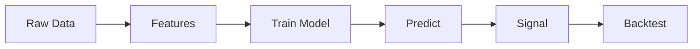

# Topic 08, Machine Learning for Trading

> What machine learning can and cannot do in trading, why most ML
> models fail in finance, and how to set up a model that has any
> chance of working out of sample.

## The big idea

Machine learning in trading is the same as machine learning anywhere
else: you turn inputs (features) into outputs (predictions) by
fitting a model on historical data, then use the fitted model on new
data. The only thing that changes is the domain. Markets are
extremely noisy, the signal-to-noise ratio is low, and the
distribution of returns is non-stationary, which means the patterns
the model learns from the past may simply not exist in the future.

This is why ML is not a magic upgrade over rule-based signals. A
linear regression on three good features will usually beat a deep
neural net on three hundred bad features. The bottleneck in
financial ML is rarely the model. It is the features and the
validation.

The right mental model is: ML is a tool that lets you combine many
weak signals into one slightly stronger signal. If you do not have
many weak signals to begin with, ML will not invent them for you.
And every time you add a feature or a parameter, you increase the
risk of overfitting, where the model memorises noise from the
training set and fails on anything new.

## Key concepts

### The standard ML pipeline

| Step | What happens |
|---|---|
| Data | Collect OHLCV plus anything else (macro, sentiment, fundamentals). |
| Features | Turn raw data into numerical inputs (returns, volatility, ratios). |
| Target | Pick what you want to predict (next-day return, next-week direction, etc). |
| Train | Fit the model on a slice of history. |
| Validate | Check generalisation on a slice the model has not seen. |
| Predict | Generate signals on fresh data. |
| Backtest | Trade the signals through the normal backtest pipeline. |

### Features, the most important step

A feature is just a number you give the model as input. Examples
that work in practice:

- Past returns over 5, 20, 60 days.
- Rolling volatility.
- Volume ratio (today's volume divided by 20-day average).
- Distance from moving average in standard deviations.
- Time of day, day of week (for intraday strategies).

Good features are relevant, stable across regimes, and intuitive.
Bad features are random, unstable, or contain future information
(also known as data leakage).

A trap many beginners fall into is "feature explosion": adding
hundreds of features and hoping the model figures out which ones
matter. This guarantees overfitting on any realistic finance
dataset. Start with five to ten features that you can explain.

### Overfitting, the central enemy

Overfitting is when the model fits the noise in the training data
instead of the signal. The classic symptom is excellent training
performance and terrible test performance.

Example:

| Model | Train accuracy | Test accuracy | Conclusion |
|---|---|---|---|
| A | 95% | 48% | Overfit. Memorised noise. |
| B | 60% | 58% | Generalises. Trust this one. |

How to reduce overfitting:

- Use simpler models. Linear regression first, decision trees second.
- Use more data, when more data exists.
- Regularise (L1 or L2 penalties).
- Use proper out-of-sample testing.
- Reduce the number of features.

### Train / validate / test split

```
| -------- Train -------- | -- Validate -- | -- Test -- |
```

The model fits on Train, hyperparameters are chosen on Validate, and
the final number is read off Test. The test set is used exactly once.
If you look at the test set and then change the model, your test
set is no longer a test set, it is part of the training process.

For time-series data the split must respect time order. Never shuffle.
The Train block always comes before the Validate and Test blocks
chronologically. Otherwise you are training on the future to predict
the past.

### Walk-forward validation

Instead of one split, walk through time:

```
[ Train_1 ][ Test_1 ]
            [ Train_2 ][ Test_2 ]
                        [ Train_3 ][ Test_3 ]
```

Retrain at each step, report the average performance across all test
periods. This catches strategies that work in one regime but fail
in another. It is much slower than a single split but much more
honest.

### Linear regression vs decision trees

The two starter models in the course:

| Linear regression | Decision tree |
|---|---|
| Output is a weighted sum of inputs. | Output follows a chain of yes/no splits. |
| Easy to interpret. Coefficients tell you what the model believes. | Easy to follow but can be deep and weird. |
| Underfits non-linear relationships. | Captures non-linearities naturally. |
| Less prone to overfitting in small data. | Very prone to overfitting unless pruned. |

For finance, start with linear regression. If a linear model cannot
find signal in your features, a tree probably will not either.

### R squared

For regression problems the standard metric:

```
R^2 = 1 - SS_res / SS_tot
```

- R-squared = 1 means perfect prediction.
- R-squared = 0 means the model is no better than predicting the
  mean.
- R-squared less than zero means the model is worse than predicting
  the mean. This happens often on financial data and is not a bug.

A realistic R-squared for next-day return prediction is in the
range of 0.005 to 0.02. That looks tiny but it can still be tradeable
if the model has positive expectancy after costs. This is the
quiet truth of financial ML: the edges are small.

## One diagram

The full ML for trading pipeline:



## Code patterns

### Building features

```python
df["Return_5"]   = df["Close"].pct_change(5)
df["Return_20"]  = df["Close"].pct_change(20)
df["Vol_20"]     = df["Return"].rolling(20).std()
df["Vol_Ratio"]  = df["Volume"] / df["Volume"].rolling(20).mean()
features = df[["Return_5", "Return_20", "Vol_20", "Vol_Ratio"]].dropna()
```

### Time-ordered train/test split

```python
split = int(len(features) * 0.7)
X_train, X_test = features.iloc[:split], features.iloc[split:]
y_train, y_test = target.iloc[:split],  target.iloc[split:]
```

### Linear regression in scikit-learn

```python
from sklearn.linear_model import LinearRegression
from sklearn.metrics import r2_score

model = LinearRegression().fit(X_train, y_train)
preds = model.predict(X_test)
print("R^2:", r2_score(y_test, preds))
```

### Turning predictions into a signal

```python
df_test = df.iloc[split:].copy()
df_test["Pred"]     = preds
df_test["Signal"]   = (df_test["Pred"] > 0).astype(int)
df_test["Position"] = df_test["Signal"].shift(1).fillna(0)
df_test["StratRet"] = df_test["Position"] * df_test["Return"]
```

## Worked example

Building features from raw OHLCV is the messy, important part of ML.
Here is a tiny example with 8 days of data. The goal: predict whether
tomorrow's close will be higher than today's (binary target).

Raw data (Close and Volume):

| Day | Close | Volume |
|---:|---:|---:|
| 1 | 100.00 | 1.0M |
| 2 | 102.00 | 1.2M |
| 3 | 101.00 | 0.9M |
| 4 | 105.00 | 1.5M |
| 5 | 103.00 | 1.1M |
| 6 | 108.00 | 1.8M |
| 7 | 107.00 | 1.0M |
| 8 | 110.00 | 1.4M |

Build four features:

1. `ret_5`: 5-day return = `Close_t / Close_{t-5} - 1`.
2. `vol_5`: 5-day rolling std of daily returns.
3. `vol_zscore_5`: today's volume minus 5-day mean volume, divided by std.
4. `close_minus_ma5`: today's close minus the 5-day MA, divided by MA.

The target `y` is `1 if Close_{t+1} > Close_t else 0`.

Features are valid from day 6 onwards (need 5 days of history). The
target is undefined for day 8 (no day 9).

| Day | ret_5 | vol_5 | vol_z_5 | close_ma5 | y |
|---:|---:|---:|---:|---:|:---:|
| 6 | 0.080 | 0.024 | +1.42 | +0.048 | 0 |
| 7 | 0.049 | 0.030 | -0.20 | +0.024 | 1 |
| 8 | 0.089 | 0.028 | +0.65 | +0.039 | n/a |

That is the entire X matrix and y vector. Three rows of features, two
labelled (days 6 and 7 have a known y). Day 8's features are valid but
its y is the future and we cannot use it for training.

Looking at this tiny sample: day 6 had the highest 5-day return and a
volume spike, but the next day fell (y=0). Day 7 had a modest return
and slightly below average volume, and the next day rose (y=1). Two
data points contradict the "high momentum predicts more upside" story.

```python
import pandas as pd
df = pd.DataFrame({
    "Close":  [100,102,101,105,103,108,107,110],
    "Volume": [1e6,1.2e6,0.9e6,1.5e6,1.1e6,1.8e6,1.0e6,1.4e6],
})
ret = df["Close"].pct_change()
df["ret_5"]        = df["Close"].pct_change(5)
df["vol_5"]        = ret.rolling(5).std()
df["vol_z_5"]      = (df["Volume"] - df["Volume"].rolling(5).mean()) / df["Volume"].rolling(5).std()
df["close_minus_ma5"] = df["Close"] / df["Close"].rolling(5).mean() - 1
df["y"] = (df["Close"].shift(-1) > df["Close"]).astype(int)
print(df.dropna().round(3))
```

**Eight days is nowhere near enough**. With three labelled examples,
any model would memorise them perfectly and tell you nothing about the
future. In practice you need thousands of days, often tens of
thousands, before the noise averages out. The point of this example is
to show the **shape** of the data ML wants: a wide table of numeric
features and a one-column target, with every row representing a single
point in time.

## Common pitfalls

- Shuffling time-series data before the train/test split. This
  leaks future information.
- Using future returns as a feature ("the return over the next 5
  days predicts the next-day return"). Always check that every
  feature uses only information available at time t.
- Training on too little data. ML models need many examples. A
  model trained on 200 days is mostly memorising.
- Trusting in-sample R-squared. A 0.4 in-sample R-squared usually
  means the model is overfitting.
- Treating accuracy or R-squared as the final goal. The goal is a
  profitable strategy after costs. A model with 51% accuracy can
  beat one with 60% accuracy if its trades are sized better.

> The single most important habit in financial ML is the
> chronological train/test split. Anything that crosses the boundary
> (shuffled CV, future features, peeking at the test set during
> tuning) destroys the result.

## How this shows up in our project

- Our project does not use ML. We chose rule-based signals (MA
  crossover and mean reversion) because they are interpretable and
  the project rubric is about understanding the workflow, not
  squeezing every basis point.
- The features we compute in `src/indicators.py` (returns,
  volatility, MA distance, volume ratio via Bollinger bands) are
  the same ones you would feed an ML model.
- If you wanted to add ML, the easiest extension is one new module
  `src/ml_signal.py` that takes the indicator DataFrame, fits a
  linear regression on the first 70% of rows, and writes
  predictions into a `Signal` column. The rest of the pipeline
  (backtest, evaluate) plugs in unchanged.

## Further reading

- `lectures/Knowledge_Base.md` Lecture 9 section.
- `lectures/ML_for_trading.ipynb` for the full lab with features,
  regression, and decision trees.
