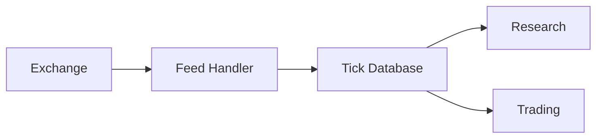

# Topic 09, Quant Infrastructure and KDB+/q

> Why quant firms cannot just use pandas, how market data actually
> flows from the exchange to the researcher's notebook, and what
> makes KDB+ the standard tool for storing tick data.

## The big idea

Modern exchanges generate enormous amounts of data. A single trading
day on a single exchange produces millions of trades and tens of
millions of quote updates. Multiply by hundreds of exchanges and
thousands of symbols, and you reach billions of data points per
day. This volume is the reason quant firms run specialised
infrastructure instead of loading CSVs into Excel.

The data has two qualities that make it hard for general-purpose
databases. First, it is time-series: every row has a timestamp and
queries are almost always "give me everything between time X and
time Y". Second, it is wide and tall: many columns, many rows, and
analytics usually only need a small subset of the columns at a
time. Column-oriented storage solves the second problem. Time-series
indices solve the first.

KDB+ (with its query language q) is the database that combines both,
and it has been the standard at quant firms for two decades. It is
not the only option (newer alternatives like ClickHouse or DuckDB
solve similar problems with friendlier interfaces) but the
conceptual model is the same. The infrastructure layer is the bridge
between raw market data and the strategies that act on it.

## Key concepts

### Where market data comes from

| Source | What it produces |
|---|---|
| Exchanges (NSE, BSE, NASDAQ, NYSE) | Trades and quotes, in many proprietary formats. |
| Feed handlers | Parse the exchange messages, normalise to one internal format, forward. |
| Tick database | Store the normalised stream forever. KDB+ lives here. |
| Research tools | Pandas, Python, notebooks. Query the tick DB for slices. |

### Trades vs quotes vs tick data

A trade is an actual execution: at this timestamp, this many shares
of this symbol changed hands at this price. A quote is just the
current best bid and ask without an execution. Tick data is the
union: every trade, every quote update, every order book change,
timestamped to the microsecond.

| Tick data | OHLC data |
|---|---|
| Every market event. | Summary per interval. |
| Microsecond precision. | Daily or minute bars. |
| Huge storage cost. | Tiny storage cost. |
| Best for microstructure research. | Best for charting and signal research. |

### Why columnar storage beats row storage

A row store keeps each record (one row) together on disk:

```
[time, sym, price, size][time, sym, price, size][...]
```

This is good for transactional systems where you typically read one
whole row at a time. It is bad for analytics, where you might want
to compute the average price across millions of rows. The database
has to read every column of every row, even though it only cares
about one.

A column store keeps each column together:

```
time:  [t1, t2, t3, ...]
sym:   [s1, s2, s3, ...]
price: [p1, p2, p3, ...]
size:  [v1, v2, v3, ...]
```

Now the average-price query reads only the price column. For wide
tables this is often 10x to 100x faster.

### KDB+ and q, the syntax in one table

The whole point of q is that it is short. The equivalent SQL is
included for comparison.

| Operation | SQL | q |
|---|---|---|
| Filter | `WHERE sym='AAPL'` | `where sym=`` `AAPL `` |
| Group | `GROUP BY sym` | `by sym` |
| Average | `AVG(price)` | `avg price` |
| Sum | `SUM(size)` | `sum size` |
| Time range | `WHERE t BETWEEN a AND b` | `where t within (a;b)` |

A full query side by side:

```sql
-- SQL
SELECT sym, AVG(price)
FROM   trades
WHERE  t BETWEEN '09:30' AND '10:00'
GROUP BY sym;
```

```q
/ q
select avg price by sym
  from trades
  where t within 09:30 10:00
```

The q version is shorter because q is built around the operations
that matter for time-series data.

### VWAP, the canonical example

VWAP (volume-weighted average price) is the standard metric used by
execution traders to measure whether they got a good fill. It is
computed as:

```
VWAP = sum(price * size) / sum(size)
```

In q this is one line. In SQL it takes three. In pandas it takes
two. The point of the lecture is not that q is "better" but that the
infrastructure layer makes some calculations natural that are
awkward elsewhere.

### Research vs production

Research is exploratory. Notebooks, broken queries, ad-hoc analysis.
Mistakes are cheap.

Production is the live system. Reliable services, careful
monitoring, controls everywhere. Mistakes cost money.

The same infrastructure feeds both. The research team queries the
tick database to develop strategies. The production team monitors
live data through the same database to run them.

## One diagram

How market data flows from the exchange to the researcher's keyboard:



## Code patterns

### Pandas as a stand-in for tick analytics on small data

When you do not have KDB+ but want to do the same analysis:

```python
# Read a parquet file (columnar, similar idea to KDB+)
import pandas as pd
trades = pd.read_parquet("trades_2024_01.parquet")

# VWAP per symbol
vwap = (trades.assign(notional=trades["price"] * trades["size"])
              .groupby("sym")
              .apply(lambda g: g["notional"].sum() / g["size"].sum()))
```

### Sketch of a Python-KDB+ workflow

```python
# Step 1: query historical tick data from KDB+
import qpython
q = qpython.qconnection.QConnection(host="kdb-host", port=5000).open()
trades = q.sync("select from trades where date=2024.01.05, sym=`AAPL")

# Step 2: turn it into a pandas DataFrame for research
df = pd.DataFrame(trades)

# Step 3: do all the usual research in pandas
df["Return"] = df["price"].pct_change()
# ... features, signals, backtest ...
```

The KDB+ side handles storage and the heavy filtering. Python
handles modelling and visualisation. This is the modern division of
labour.

## Worked example

A 5-row tick table for two symbols on one trading day. In KDB+ this
would be a single column-oriented table called `trades`.

| time | sym | price | size |
|---|---|---:|---:|
| 09:30:01.245 | SPY | 450.05 | 100 |
| 09:30:01.812 | QQQ | 380.20 | 50  |
| 09:30:02.100 | SPY | 450.07 | 200 |
| 09:30:02.890 | QQQ | 380.18 | 75  |
| 09:30:03.450 | SPY | 450.04 | 150 |

We want the average trade price per symbol. The q query is one line:

```q
select avg price by sym from trades where date=2024.06.01
```

Output:

```
sym  | price
-----| ------
SPY  | 450.0533
QQQ  | 380.19
```

The same operation in pandas takes more lines and more memory:

```python
import pandas as pd
trades = pd.read_csv("trades_2024_06_01.csv", parse_dates=["time"])
day = trades[trades["time"].dt.date == pd.Timestamp("2024-06-01").date()]
result = day.groupby("sym")["price"].mean()
print(result)
```

For 5 rows this is fine. For 50 million rows (one trading day on a
major exchange) the pandas version loads everything into RAM, often
exceeding the machine's memory. KDB+ never loads more than the column
it needs, and the `where date=...` clause filters at the disk-page
level before any in-memory work. The same query returns in milliseconds
on a tick database that pandas could not even open.

A second example. Computing minute bars (OHLC per minute per symbol):

```q
select open: first price, high: max price, low: min price, close: last price, vol: sum size
  by 1 xbar time.minute, sym
  from trades
```

That single line replaces about 20 lines of pandas resampling code,
and runs orders of magnitude faster on real-sized data.

The takeaway: KDB+ is built on three ideas that make it fast for
time-series. Columns are stored separately so you only read what you
need. Tables are typed and dense (no row overhead). The query language
is built around time as a first-class concept (`xbar`, `asof`, `wj`).
For ad-hoc research on small data, pandas is friendlier. For
production-scale tick data, KDB+ is what the industry runs on.

## Common pitfalls

- Loading tick data into pandas without filtering it down at the
  database first. A single day of NSE tick data can be tens of
  gigabytes. Filter early.
- Using row-store databases (Postgres, MySQL) for tick data. They
  will work for prototypes but fall over at production scale.
- Treating timestamps as strings. Always parse to a proper datetime
  type before comparing. Off-by-one timezone errors are common.
- Forgetting that the production system also writes tick data, in
  real time, while research is querying historical data. Race
  conditions and stale-data bugs lurk here.

> The infrastructure layer is invisible when it works and
> catastrophic when it does not. A well-designed tick database lets
> a researcher run a five-year backtest in seconds. A badly
> designed one makes the same research take days, which means it
> does not happen.

## Further reading

- `lectures/Knowledge_Base.md` Lecture 10 section.
- The KDB+ documentation at code.kx.com (out of scope for the
  project but worth a skim if this topic is interesting).
