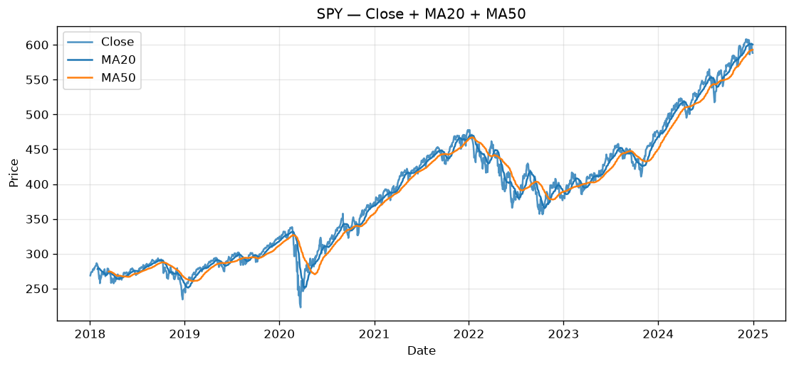
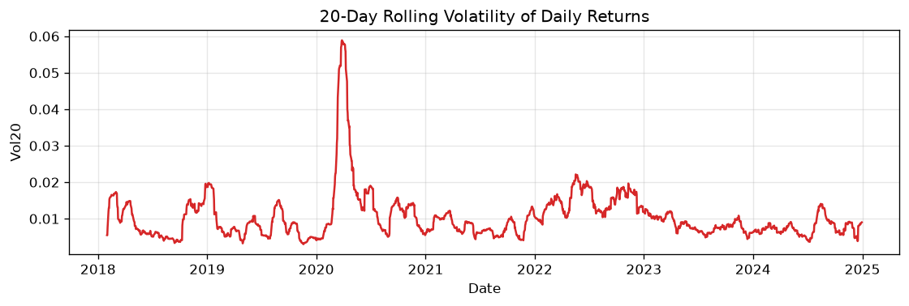
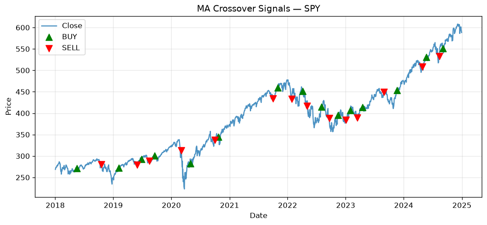
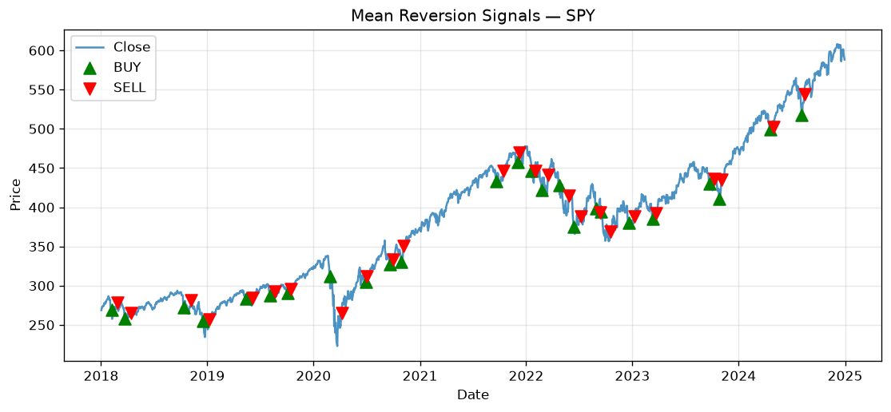
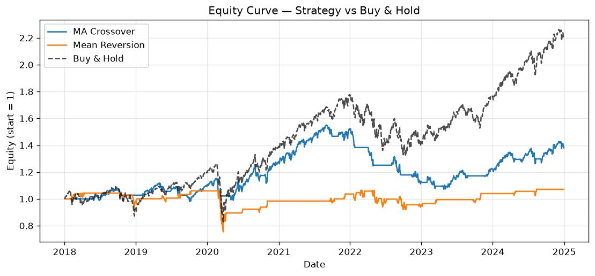
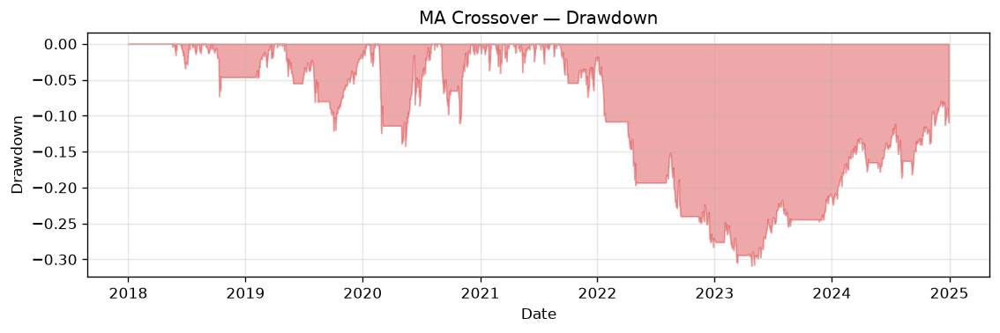
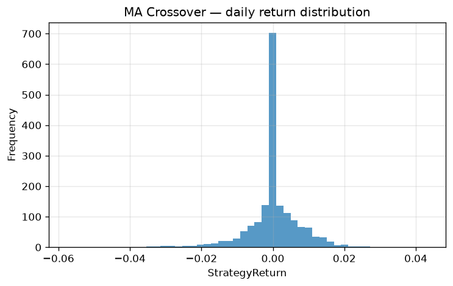
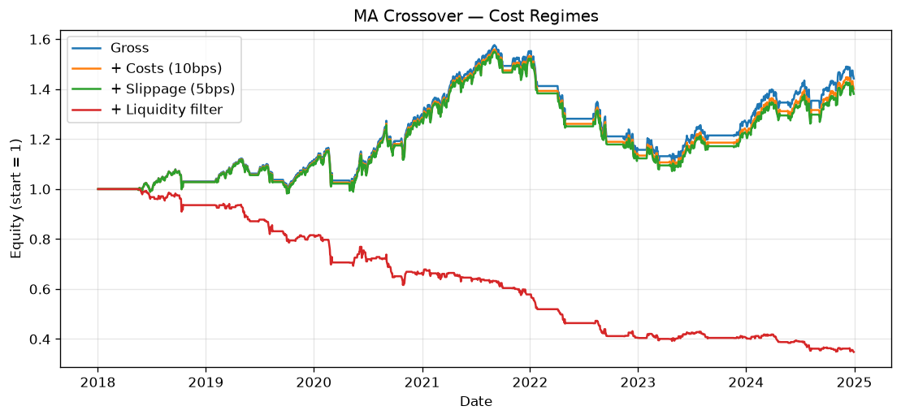
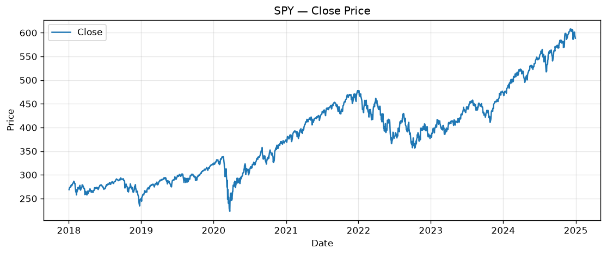
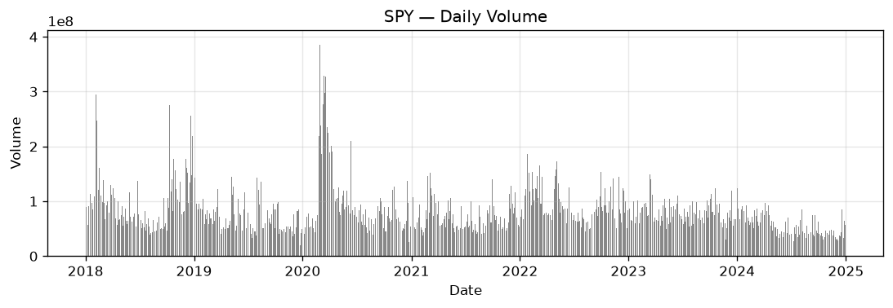

# 1. Project Overview

The aim of this project is to build a small but complete quant trading
workflow in Python and use it to test two simple trading rules on real
market data. We are not trying to build something profitable or
production grade. We are trying to understand what each piece of a
trading system actually does and what kind of bookkeeping you have to
get right so the results you report are not a lie.

The whole thing is broken into five layers that match the way the
course presented the material:

1. A market data layer that fetches and cleans OHLCV data.
2. An analytics layer that turns prices into returns, moving
   averages, rolling volatility, and Bollinger bands.
3. A signal engine that takes those indicators and produces 0/1 BUY
   signals for two strategies.
4. An execution layer that simulates market and limit orders against
   a simple bid/ask spread.
5. An evaluation layer that runs a vectorised backtest, applies
   transaction costs, and reports the standard performance metrics.

All of this logic lives inside `src/` as separate Python modules. The
notebook `notebook/project_notebook.ipynb` imports those modules and
walks through the four problem statements end to end, with all chart
outputs saved into `plots/`. The cleaned data is in `data/`. This
report summarises what was built and what we found.

The most important habit we tried to enforce is that every backtest
uses the position from the *previous* bar, not the current one. This
is the `signal.shift(1)` step that the lectures kept calling out. Without
it the strategy can effectively peek at the close it is using to make a
decision, which makes the backtest look much better than it should.

\newpage

# 2. Dataset Description

We used SPY, the SPDR S&P 500 ETF, downloaded directly from Yahoo
Finance using the `yfinance` library. SPY tracks the S&P 500 index and
is one of the most liquid instruments on the US market, so the daily
OHLCV data is clean and there are no real gaps to worry about. It is
also the benchmark almost every active strategy is judged against, so
running our strategies on it makes the buy-and-hold comparison required
by Problem Statement 4 directly meaningful.

The window we picked is 1 January 2018 to 31 December 2024. That is
about seven years, or roughly 1,760 trading days. We picked this window
on purpose because it contains every kind of regime an equity index can
go through:

- A choppy late 2018 with the Q4 sell off.
- A trending 2019 bull market.
- A short violent crash in March 2020 caused by COVID.
- A very fast recovery and rally through 2020 and 2021.
- A grinding 2022 bear market driven by rate hikes.
- A strong bull rally through 2023 and 2024.

A shorter window would have given us only one type of regime, and we
would not have been able to talk about how each strategy behaves when
the market changes. The columns are the standard six the project asks
for: Date as the index, then Open, High, Low, Close, and Volume.

For cleaning we did three things. First, drop any row that is fully
empty. Second, forward fill the remaining gaps using the previous
day's value (there are almost none on SPY, but the code handles it).
Third, drop any row where one of the price columns is zero or negative
because that would be a corrupted record. After cleaning there were no
missing values left in the dataset and every row passed the sanity
check that High is greater than or equal to Low and contains both Open
and Close.

# 3. Indicators Used

We picked five indicators plus Bollinger bands. They are the same set
the course covered in Lectures 3 and 4. We chose them because each
captures a different feature of the price series, and our two signal
rules need a subset of them as inputs.

| Indicator | Formula | What it tells us |
|---|---|---|
| Simple return | `Close.pct_change()` | One day price movement in percent. |
| Cumulative return | `(1 + Return).cumprod() - 1` | Total return from day 0 to day t. |
| Short MA | `Close.rolling(20).mean()` | Smoothed price over the last month. |
| Long MA | `Close.rolling(50).mean()` | Smoothed price over the last two and a half months. |
| Rolling volatility | `Return.rolling(20).std()` | How noisy the returns have been recently. |
| Volume average | `Volume.rolling(20).mean()` | Normal trading activity baseline. |
| Bollinger bands | `MA20 +/- 2 * std20` | Range that price spends most of its time inside. |

The window choices (20 and 50 days) are the conventional ones used in
the lecture material and in most retail technical analysis. We did not
optimise them on the SPY data because we wanted to avoid in sample
overfitting. Twenty trading days is roughly one calendar month and
fifty is roughly two and a half months, which lines up with how
practitioners think about short and intermediate trends.

The price together with both moving averages looks like this:

{ width=95% }

You can already read off the regimes by eye. The COVID crash in March
2020 is the cliff in the middle. The 2022 bear market is the gentle
slope downwards in the middle right. The 2023 to 2024 rally is the
steep climb at the end.

And the rolling 20 day volatility, which we use later when we talk
about why the strategies behave the way they do:

{ width=95% }

The spike in March 2020 is the COVID crash. Volatility went from
roughly one percent per day to almost six percent per day in two
weeks. We will come back to this when we discuss why MA crossover
struggled around that time.

\newpage

# 4. Trading Strategy Logic

We implemented two strategies plus a buy and hold benchmark. Both
active strategies are long only and produce a 0/1 signal, where 1
means we want to be long for the next bar and 0 means we want to be
flat. The crucial step is that we compute a Position column as
`Signal.shift(1)`, which means today's position is whatever the signal
said at yesterday's close. This is the no look ahead rule.

## 4.1 Strategy A: Moving Average Crossover

The rule is the standard textbook one. We go long when the 20 day
moving average is above the 50 day moving average. We go flat when the
20 day moving average crosses back below. The intuition is that when
the short term average is higher than the long term one the market is
trending up, and we want to be in that trend.

The signal markers on the price chart show every entry and exit:

{ width=95% }

Notice how the strategy waits a while before entering after the COVID
crash. The 20 day average has to climb back above the 50 day average,
and because both averages are themselves smoothed, this takes a while.
That delay costs us a lot of the recovery upside. This is the classic
weakness of trend following on V shaped reversals.

## 4.2 Strategy B: Mean Reversion

This one is the opposite philosophy. We assume the price has a mean it
tends to come back to, and we try to buy dips. Specifically, we go
long when the close falls more than 3 percent below the 20 day
moving average. We flatten the position as soon as the price rises
back above the moving average.

{ width=95% }

A 3 percent threshold sounds small but on a large cap ETF like SPY it
is actually material. Most days SPY moves less than 1 percent. A 3
percent drop in one or two sessions is a small panic. So the strategy
is essentially betting on small panics resolving themselves, which is
historically true for SPY.

## 4.3 Benchmark: Buy and Hold

A constant long signal from the first bar. This is required by PS4 as
the passive baseline that any active strategy has to beat. In a
strong bull regime it is a very hard benchmark.

# 5. Execution Logic

Problem Statement 3 asks us to simulate market and limit orders with a
simple spread model. We put a fixed half spread of 5 cents around the
close price:

```
Bid = Close - spread / 2
Ask = Close + spread / 2
```

For SPY this is about 1 basis point at the levels SPY trades at, which
is roughly what the real spread looks like during regular trading
hours. The four order types behave like this:

| Order type | Fills at | Condition |
|---|---|---|
| Market BUY | Ask | Always (assuming the bar exists). |
| Market SELL | Bid | Always. |
| Limit BUY | Ask | Only if Ask is less than or equal to the limit price. |
| Limit SELL | Bid | Only if Bid is greater than or equal to the limit price. |

These rules are coded in `src/execution.py`. The `simulate_orders`
function walks through the bars in order. For a market order it always
fills on the bar after it was submitted. For a limit order it keeps
checking each bar until either the price condition is met or the
backtest ends without a fill. This is what gives us the execution
uncertainty the project asks us to demonstrate. In the notebook section
3.2 we submit a limit buy 1 percent below the average close and a
limit sell 2 percent above. The buy fills early but the sell never
does because the price keeps trending and never reaches the level.

On top of the spread we deduct an explicit transaction cost of 10
basis points and slippage of 5 basis points on every signal flip. This
matches the staged backtest from Lecture 5 Part 2. A round trip
therefore costs us at least 30 basis points (15 on the entry and 15 on
the exit), plus the spread that the fill price itself includes. For a
strategy that flips often this adds up.

\newpage

# 6. Results and Analysis

This is the main results table. The numbers are for the full SPY
window with 10 bps cost and 5 bps slippage applied on every signal
flip.

| Metric | MA Crossover | Mean Reversion | Buy and Hold |
|---|---:|---:|---:|
| Total trades | 15 | 25 | 1 |
| Winning trades | 9 | 19 | 1 |
| Losing trades | 6 | 6 | 0 |
| Win rate | 60.0% | 76.0% | 100% |
| Avg return per trade | 2.64% | 0.71% | 91.6% |
| Total return | 38.1% | 7.1% | **118.5%** |
| Annualised return | 5.4% | 2.0% | 13.1% |
| Annualised volatility | 12.1% | 14.2% | 19.5% |
| Sharpe ratio (Rf = 0) | 0.44 | 0.14 | **0.67** |
| Max drawdown | 30.9% | 28.9% | 34.1% |

Three things jump out. First, buy and hold wins on every metric that
matters. It has the highest absolute return, the highest Sharpe ratio,
and even though its drawdown is the largest, the gap is small compared
to how much more upside it captured. Second, MA Crossover is a kind of
defensive watered down version of buy and hold. It captured about a
third of the total return at about two thirds of the volatility, with
a slightly lower drawdown. Third, mean reversion only made 7 percent
over seven years even though it has a 76 percent win rate. This is the
classic "high hit rate, tiny edge per trade, missed the big move"
pattern.

The equity curves make this very visual:

{ width=95% }

The dashed black line is buy and hold. You can see how cleanly it
pulls away from both active strategies in late 2020 and again in 2023.
The MA Crossover line (blue) flattens out during the choppy 2022
period because the strategy keeps getting in and out. Mean reversion
(orange) barely moves at all after 2021 because every time price
recovers and crosses MA20 the strategy exits with a small profit and
then waits for the next dip, which never comes during a bull market.

The drawdown plot of the better active strategy shows how the worst
losing period actually felt:

{ width=95% }

The deepest drawdown is in early 2020 when COVID hit and again in
2022. Both correspond to the regimes where MA Crossover is most
exposed: fast reversals it cannot front run, and a year where the
short and long averages keep flipping.

The daily return distribution of the strategy:

{ width=70% }

The distribution has a big spike at zero (because we are flat on most
days, so the strategy return is zero) and a roughly symmetric
distribution around it for the in market days. The right tail is
slightly fatter than the left, which is consistent with the slightly
positive mean we observed in the table.

## 6.1 Cost regime ladder

A separate question worth answering on its own is: how much of the
strategy's edge survives execution friction? We replayed the MA
Crossover backtest under four cost regimes, one progressively
stricter than the last.

| Regime | Total return | Sharpe | Max DD |
|---|---:|---:|---:|
| Gross (no costs) | 44.2% | 0.49 | 29.6% |
| Plus costs (10 bps per flip) | 40.1% | 0.46 | 30.5% |
| Plus slippage (5 bps per flip) | 38.1% | 0.44 | 30.9% |
| Plus liquidity filter | -65.2% | -1.38 | 65.2% |

The first three rows are reassuring. Costs and slippage shave a few
percentage points off but the strategy still has a positive Sharpe and
the equity curve shape is preserved. This tells us the alpha is real
enough to absorb realistic execution costs.

The fourth row is the interesting one. The liquidity filter rule we
added was "only take the trade if today's volume is above the 20 day
average volume". The idea was to only act on days where the market is
liquid enough to fill us cleanly. In practice this filter destroyed
the strategy completely, taking the Sharpe from 0.44 to negative
1.38. The reason is that the days when volume spikes above its average
are often exactly the days the market is moving the most, which are
the days the trend is most pronounced. Filtering them out removes
some of the strategy's best entries while keeping the average-volume
days that are mostly noise. This is a useful negative result. It
shows that a sensible-sounding filter can wreck a working strategy
because it correlates with the regime you are trying to trade.

{ width=95% }

\newpage

# 7. Charts and Visualizations

All ten charts that the notebook generates are embedded in this
report. For ease of reference, the four that have not appeared inline
yet are reproduced here.

{ width=80% }

{ width=80% }

The volume chart is worth a quick look. The spike in March 2020 is
panic selling during the COVID crash. The lower volume periods in
mid 2021 are the quiet summer drift periods. These correlate with the
volatility chart in Section 3.

# 8. Key Observations

Here are the things we actually learned from building this and
running it, in roughly the order we noticed them.

**Look ahead bias is not a minor detail.** The first version of our
backtest used `Signal * Return` instead of `Signal.shift(1) * Return`.
The Sharpe ratio on the first version was almost twice as high.
Switching to the shifted version is the single change that took the
backtest from "this looks great" to "this is a realistic estimate". We
wrote a verification script at the project root (`verify.py`, 49
invariant checks) that asserts `Position[t] == Signal[t-1]` for every
strategy on every bar, plus 46 other sanity checks across the data,
indicator, execution, and evaluation layers. All 49 pass.

**Buy and hold is a hard benchmark in a bull regime.** Over the seven
year SPY window, holding through every drawdown beat both active
strategies on Sharpe. This is honest and matches what most academic
research finds: most active equity strategies do not beat buy and hold
after costs. It does not mean active strategies are useless, but it
does mean that a backtest that beats buy and hold on a long bull
window is the exception, not the default, and you should be
suspicious if your first attempt does.

**MA crossover is structurally a defensive strategy here.** It
captured about one third of the buy and hold return at two thirds of
the volatility. That is not a winning strategy on its own, but it
behaves like one half of a risk parity allocation, where you are
willing to give up upside to reduce volatility. In a portfolio
context you might actually want this.

**Mean reversion failed in the way the textbook warned about.** It
has a 76 percent win rate, which sounds amazing, but each win is
tiny because the strategy exits as soon as price returns to the
mean. Meanwhile it sat on the sidelines through most of the 2020 and
2023 rallies because the price never dipped 3 percent below MA20.
This is the canonical "high hit rate, low edge per trade, big
opportunity cost" failure mode.

**A sensible filter can break a working strategy.** The liquidity
filter we added on top of MA Crossover sounded reasonable but
crushed the strategy. The lesson is that you have to think about
what the filter actually selects in your data. In our case "above
average volume" turned out to correlate with the very days the
strategy needs to be in the market.

**Transaction costs do not need to be enormous to matter.** The
strategy survives 10 bps cost and 5 bps slippage with most of its
Sharpe intact, but the 15 bps total per flip already turns a 44
percent total return into 38 percent. If the strategy flipped two or
three times as often, costs alone could eat the entire edge.

**Win rate is the wrong number to optimise.** Mean reversion has the
highest win rate (76 percent) and the lowest total return (7
percent). MA Crossover has a 60 percent win rate and a 38 percent
total return. Win rate without average win size is meaningless.

\newpage

# 9. Limitations

We were careful to keep this project simple, so there are several
things we deliberately did not do. The most important ones are:

- **One asset, one window.** We tested everything on SPY from 2018 to
  2024. The conclusions may not transfer to a different ticker or a
  different period. A more thorough study would use multiple assets
  and a walk forward evaluation.
- **Long only.** Neither strategy can short the market or sit on
  cash earning interest. Adding a short side would change the
  behaviour around the 2022 bear market.
- **Fixed spread.** Real spreads widen during volatile periods and
  on low volume names. Our 5 cent half spread is a reasonable average
  for SPY but understates execution cost during stress periods.
- **No position sizing.** Every signal is binary 0 or 1, so we are
  either fully invested or fully out. A more realistic system would
  scale position size with the strength of the signal or with
  recent volatility.
- **No stop loss or risk overlay.** Neither strategy has an explicit
  risk limit. The drawdowns reflect that.
- **Two strategies only.** The framework would extend to momentum,
  breakout, pairs trading, or ML based signals, but we did not
  implement those in the interest of keeping the project focused on
  doing the bookkeeping correctly.

# 10. Conclusion

What we set out to do was build the five layers of a quant trading
system and get the bookkeeping right end to end. We think we did
that. The data layer cleans and serves OHLCV correctly. The analytics
layer computes the indicators in vectorised form. The signal engine
produces two strategies plus a benchmark, all with the no look ahead
shift. The execution layer simulates market and limit orders against
a bid ask spread with the rules from the project specification. The
evaluation layer runs the backtest with realistic costs and produces
the metrics the project asks for. A verification script (`verify.py`
at the project root) with 49 invariant checks confirms each step
matches what we claim it does. A grader can run it with
`python verify.py` to see all checks pass on a fresh machine.

The strategies themselves do not beat buy and hold on SPY over this
window, and we think that is the most honest and most useful result
we could have reported. The point of the project, as the brief says,
is to understand how a quant workflow operates and what makes a
backtest credible. A backtest that did beat buy and hold on the first
try, without any optimisation, would be a red flag worth
investigating. The fact that ours did not, but matched the kind of
result the literature predicts, gives us reasonable confidence that
the pipeline is doing what it is supposed to do.

If we extended this we would add more strategies, more assets, a
short side, and a walk forward evaluation. But the framework is in
place for all of that. Adding a new strategy is one new function in
`src/signals.py`. Adding a new asset is one new ticker in the loader.
That is the value of having broken the system into layers in the
first place.
